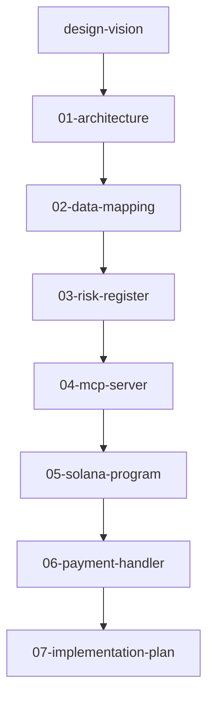
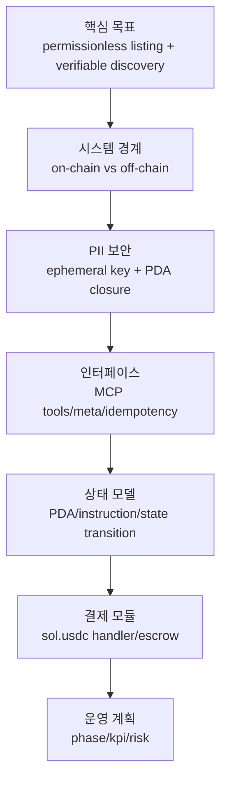

# Solana Decentralized Commerce Registry (UCP + MCP)

검열 저항적인 온체인 상점/상품 등록 시스템. 핵심은 결제 최적화가 아니라
`누구나 등록 가능(permissionless listing) + UCP 기반 discovery + 검증 가능한 신뢰`다.

## 독해 가이드

- 추천 독자: 웹 백엔드/플랫폼 3년차 이상
- 읽는 전략: `왜 이 구조인가`를 먼저 잡고, 구현 상세는 뒤 문서에서 채운다
- 처음부터 정확히 몰라도 되는 개념: AP2 세부, escrow release 정책, full replacement edge case
- 먼저 잡아야 하는 축:
`registry/discovery (핵심)`과 `payment (모듈)`의 분리

## 기획서 (v8)

| 문서 | 내용 |
|------|------|
| [design-vision.md](docs/design-vision.md) | 방향성/이념: 등록 자유 + discovery 신뢰 + 결제 모듈화 |
| [01-architecture.md](docs/01-architecture.md) | 전체 구조와 시스템 계층 (코드 없는 개요) |
| [02-data-mapping.md](docs/02-data-mapping.md) | 데이터 원칙과 on/off-chain 경계 (코드 없는 설계) |
| [03-risk-register.md](docs/03-risk-register.md) | 리스크/거버넌스/운영 관점의 의사결정 기준 |
| [04-mcp-server.md](docs/04-mcp-server.md) | discovery/조회 중심 MCP 인터페이스 설계 |
| [05-solana-program.md](docs/05-solana-program.md) | Solana Program 상세 (PDA/Instruction/상태 전이) |
| [06-payment-handler.md](docs/06-payment-handler.md) | `sol.usdc` Payment Handler (선택형 결제 모듈) |
| [07-implementation-plan.md](docs/07-implementation-plan.md) | 단계별 구현 계획, KPI 게이트, 배포 전략 |

## 권장 읽기 순서

1. `design-vision.md`
2. `01-architecture.md`
3. `02-data-mapping.md`
4. `03-risk-register.md`
5. `04-mcp-server.md`
6. `05-solana-program.md`
7. `06-payment-handler.md`
8. `07-implementation-plan.md`

## 핵심 설계 결정

- **MCP Server는 AI Agent 측에서 실행** (중앙 서버 불필요)
- **데이터 3계층**: Solana(신뢰 상태) + Agent-local DB(PII/세션) + Arweave(미디어)
- **Buyer PII 보안**: 주문별 ephemeral key로 암호화 → on-chain 임시 저장 → Merchant 수신 후 PDA 닫기
- **결제 모듈 분리**: registry/discovery와 payment는 독립적으로 진화

## 개념 의존 관계

## UCP 프로토콜 레퍼런스

UCP(Universal Commerce Protocol) 개념 문서는 `docs/concepts/` 폴더에 정리되어 있다.

| 문서 | 설명 |
|------|------|
| [concepts/00-our-scope.md](docs/concepts/00-our-scope.md) | 우리 프로젝트의 UCP 적용 범위 가이드 (Registry-first) |
| [concepts/01-overview.md](docs/concepts/01-overview.md) | UCP 프로젝트 전체 개요 및 아키텍처 |
| [concepts/02-payment-flow.md](docs/concepts/02-payment-flow.md) | 결제 흐름 (Cart → Checkout → Payment → Order) |
| [concepts/03-ap2-security.md](docs/concepts/03-ap2-security.md) | AP2 보안 결제 위임 (암호학적 Mandate 체계) |
| [concepts/04-rest-vs-mcp.md](docs/concepts/04-rest-vs-mcp.md) | REST vs MCP 바인딩 상세 비교 |

## 원본 저장소

- 경로: `~/temp/ucp`
- 원격: https://github.com/Universal-Commerce-Protocol/ucp
- 공식 문서: https://ucp.dev
