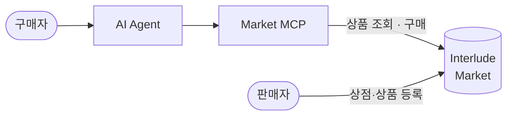
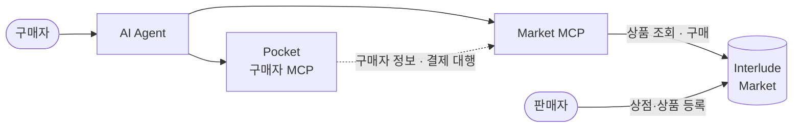
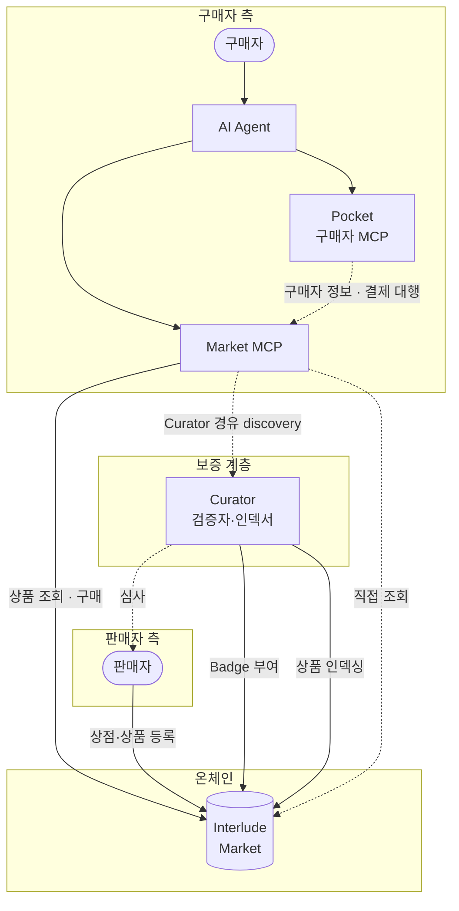

# Interlude

**Solana 블록체인 기반 탈중앙화 커머스 에코시스템.**

---

## 1. 출발점: Market

누구나 상점과 상품을 등록하고, AI Agent가 이를 검색·구매할 수 있는 온체인 커머스 레지스트리.



- 판매자는 Solana에 상점/상품을 **permissionless**로 등록
- AI Agent는 Market MCP Server를 통해 상품을 검색하고 체크아웃
- 중앙 서버 없음 — MCP Server는 Agent-local에서 구동

> 상세: [`docs/market/`](docs/market/)

---

## 2. 문제: 구매자 정보 관리

Market만으로도 거래는 가능하다. 하지만 매번 이름, 배송지, 결제수단을 직접 입력해야 한다.
개인정보가 여러 곳에 흩어지고, Agent가 자율적으로 구매를 대행하기 어렵다.

### → Pocket 등장

구매자 측에서 실행되는 Agent-local MCP 서비스. 개인정보, 배송지, 결제수단, 선호도를 안전하게 보관하고 체크아웃 시 자동으로 제공한다.



- PII 원본은 Pocket에만 존재 — Market에는 해시만 전달
- 로컬 암호화 저장 (AES-256-GCM, OS keychain 연동)
- Pocket 없이도 Market은 동작 (수동 입력 가능)

> 상세: [`docs/pocket/`](docs/pocket/)

---

## 3. 문제: 신뢰와 검색 품질

Permissionless 등록은 자유를 주지만, 스팸 상점과 사기 판매자도 자유롭게 등록된다.
온체인 직접 조회는 느리고, 구매자는 어떤 판매자를 믿어야 할지 판단할 기준이 없다.

### → Curator 등장

웹 인증서(CA)와 동일한 신뢰 모델. Curator가 판매자를 심사하고 **Badge**를 부여한다.
또한 온체인 상품을 인덱싱하여 빠른 검색을 제공한다.



- Curator는 독립 주체 — 복수의 Curator가 경쟁하며 신뢰를 형성
- Badge는 MerchantProfile에 on-chain 임베딩 — AI Agent가 즉시 검증 가능
- 구매자가 신뢰하는 Curator를 등록하면 해당 Curator 경유로 discovery
- Curator 없이도 직접 온체인 조회 가능 (fallback)

> 상세: [`docs/curator/`](docs/curator/)

---

## 핵심 설계 결정

- **Registry-first** — 핵심은 결제가 아니라 permissionless listing + verifiable discovery
- **결제는 독립 모듈** — 레지스트리와 결합하지 않고 점진 도입
- **Agent-local** — 중앙 서버 없이, 구매자 Agent 내에서 직접 구동
- **PII 이중 방어** — ephemeral key + PDA closure로 개인정보 최소 노출
- **Curator Badge = CA 모델** — 웹 인증서처럼, Curator가 Merchant 신뢰를 보증
- **데이터 3계층** — Solana(신뢰 상태) + Agent-local DB(PII/세션) + Arweave(미디어)

---

## 문서 구조

```
docs/
├── vision.md              — 비전과 핵심 결정
├── market/                — Market (온체인 커머스)
├── pocket/                — Pocket (구매자 MCP 서비스)
├── curator/               — Curator + Badge (보증 계층)
├── operations/            — 로드맵 + 리스크
└── reference/             — UCP 매핑, 에러 코드, 프로토콜 레퍼런스
```

전체 비전은 [`docs/vision.md`](docs/vision.md)을 참고하세요.

---

## License

MIT
