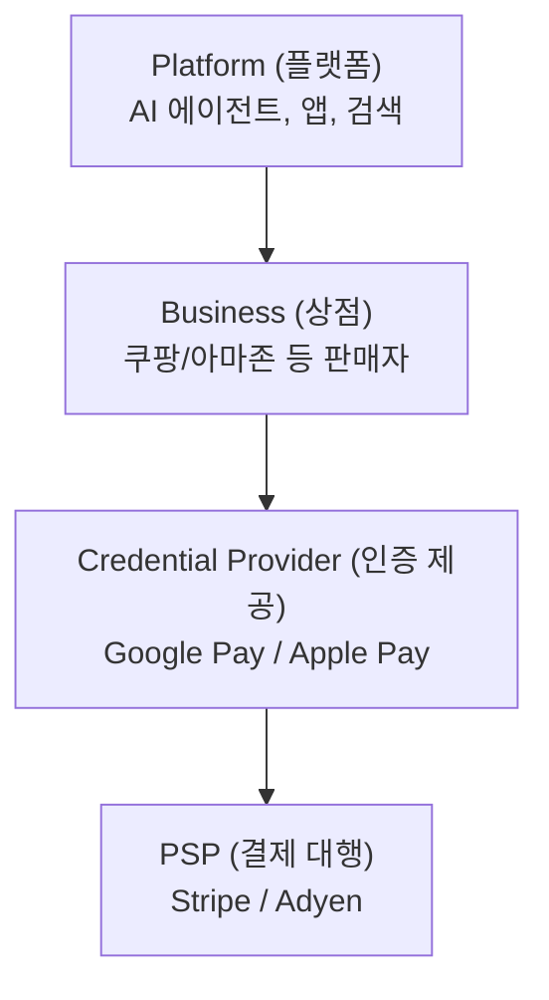
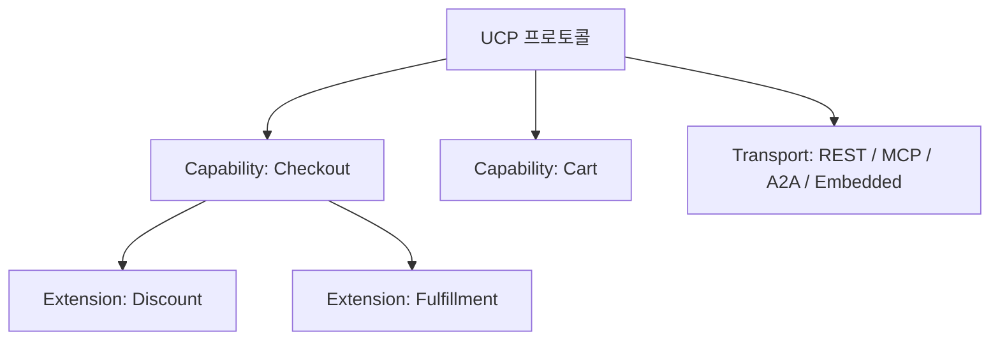
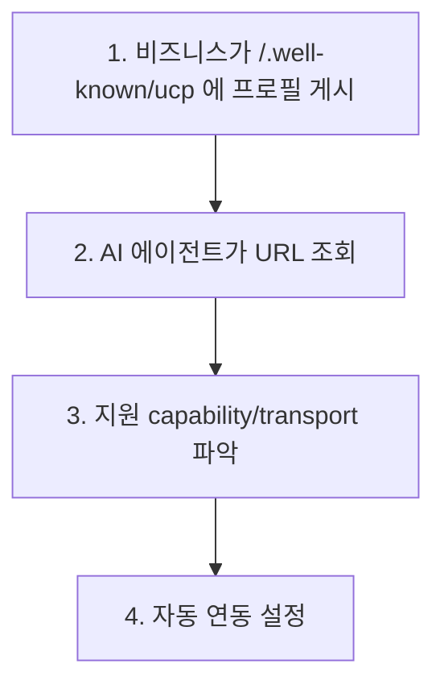
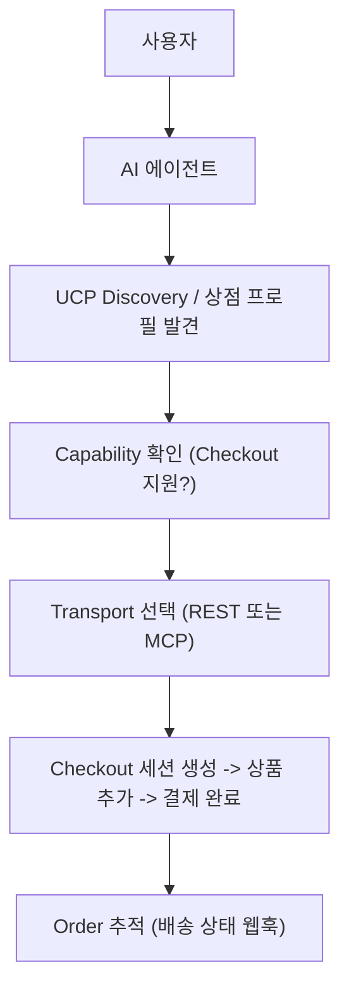

# 01. UCP 프로젝트 전체 개요

> 우리 프로젝트 적용 범위는 먼저 [00-our-scope.md](./00-our-scope.md)를 참고.

## 독해 가이드

- 이 문서의 목표:
UCP의 공통 프레임(Capability/Extension/Transport)을 잡는다.
- 지금 몰라도 되는 것:
Checkout 세부 상태 전이, AP2 mandate 서명 구조
- 여기서 꼭 잡을 것:
UCP는 데이터 모델과 전송 바인딩을 분리한다는 점

## UCP란?

**Universal Commerce Protocol** = 전자상거래를 위한 공용 언어(프로토콜)

다양한 커머스 주체(AI 에이전트, 앱, 상점, 결제 대행사)가 **동일한 규격**으로 소통할 수 있게 하는 오픈 표준이다. 특히 AI 에이전트가 사용자를 대신해 상품 검색, 장바구니 관리, 결제까지 자동 수행하는 **에이전틱 커머스(Agentic Commerce)** 시대를 위해 설계되었다.

### 핵심 참여자



### 만든 곳

- **공동 개발**: Google, Shopify, Etsy, Wayfair, Target, Walmart
- **지지 기업**: Visa, Mastercard, Stripe, PayPal 등 30개+
- **라이선스**: Apache 2.0
- **공식 사이트**: https://ucp.dev

---

## 이 저장소의 성격

실행 가능한 애플리케이션이 아니라 **프로토콜 명세서(Specification)** 저장소이다.

| 폴더 | 역할 |
|------|------|
| `source/` | 프로토콜의 **스키마 정의** (JSON Schema 파일들) |
| `docs/` | 사람이 읽는 **문서** (ucp.dev 웹사이트 소스) |
| `generated/` | 스키마에서 자동 생성된 **TypeScript 타입** |

---

## 핵심 아키텍처: Capability + Extension + Transport

UCP의 아키텍처는 **레고 블록**처럼 조립식이다.



### Capability (기능 단위) - 4가지

| Capability | 역할 | 스키마 |
|------------|------|--------|
| **Checkout** | 결제 세션 (장바구니 → 결제 완료) | `checkout.json` |
| **Cart** | 장바구니 탐색 (결제 전 단계) | `cart.json` |
| **Order** | 주문 이후 추적 (배송, 반품 등) | `order.json` |
| **Identity Linking** | OAuth 2.0 사용자 인증 연동 | - |

### Extension (확장 기능) - Checkout에 붙는 옵션

| Extension | 역할 | 스키마 |
|-----------|------|--------|
| **Discount** | 할인/쿠폰 | `discount.json` |
| **Fulfillment** | 배송 옵션 | `fulfillment.json` |
| **AP2 Mandate** | 보안 결제 위임 | `ap2_mandate.json` |
| **Buyer Consent** | 구매자 동의 | `buyer_consent.json` |

### Transport (통신 방식) - 같은 기능을 다른 방식으로 호출

| Transport | 대상 | 명세 형식 |
|-----------|------|----------|
| **REST** | 전통 앱/웹 | OpenAPI 3.1 |
| **MCP** | AI 에이전트 (LLM) | OpenRPC 1.3.2 |
| **A2A** | 에이전트 간 통신 | - |
| **Embedded** | 내장 프로토콜 | OpenRPC |

---

## `source/` 폴더 구조

```
source/
├── discovery/
│   └── profile_schema.json      ← 비즈니스가 "나는 이런 기능 지원해요" 선언
│
├── schemas/
│   ├── ucp.json                 ← 최상위 메타 스키마 (모든 것의 기반)
│   ├── capability.json          ← Capability 정의 규격
│   ├── service.json             ← Transport 바인딩 규격
│   ├── payment_handler.json     ← 결제 처리자 규격
│   │
│   ├── shopping/                ← 쇼핑 도메인 스키마
│   │   ├── checkout.json        ← 결제 세션
│   │   ├── cart.json            ← 장바구니
│   │   ├── order.json           ← 주문
│   │   ├── payment.json         ← 결제 정보
│   │   ├── discount.json        ← 할인 확장
│   │   ├── fulfillment.json     ← 배송 확장
│   │   ├── ap2_mandate.json     ← AP2 보안 확장
│   │   ├── buyer_consent.json   ← 구매자 동의 확장
│   │   └── types/               ← 35개+ 재사용 타입
│   │       ├── buyer.json, item.json, line_item.json
│   │       ├── payment_instrument.json, card_credential.json
│   │       ├── token_credential.json, binding.json
│   │       ├── total.json, postal_address.json
│   │       ├── message.json, message_error.json
│   │       ├── expectation.json, fulfillment_event.json
│   │       └── adjustment.json, order_line_item.json ...
│   │
│   └── transports/
│       └── embedded_config.json
│
├── services/shopping/
│   ├── rest.openapi.json        ← REST API 명세 (OpenAPI 3.1)
│   ├── mcp.openrpc.json         ← MCP 명세 (OpenRPC)
│   └── embedded.openrpc.json    ← Embedded 명세
│
└── handlers/tokenization/
    └── openapi.json             ← 토큰화 API 명세
```

---

## 빌드 도구

| 파일 | 역할 |
|------|------|
| `main.py` | MkDocs 플러그인. JSON 스키마 → 문서 페이지 API 테이블 자동 생성 |
| `hooks.py` | 빌드 시 `$ref` 경로를 절대 URL로 변환, 버전 번호 주입 |
| `generate_ts_schema_types.js` | JSON 스키마 → TypeScript 타입 자동 생성 (`generated/schema-types.ts`) |
| `mkdocs.yml` | 문서 사이트 설정 (내비게이션, 테마, 플러그인) |

---

## Discovery 메커니즘

AI 에이전트가 상점을 자동 발견하는 방법:



---

## 버전 관리

- **날짜 기반 버전**: `2026-01-11` 형식
- 현재: **"draft"** 상태
- MkDocs **mike** 플러그인으로 여러 버전의 문서를 동시 호스팅

---

## 전체 흐름 요약


