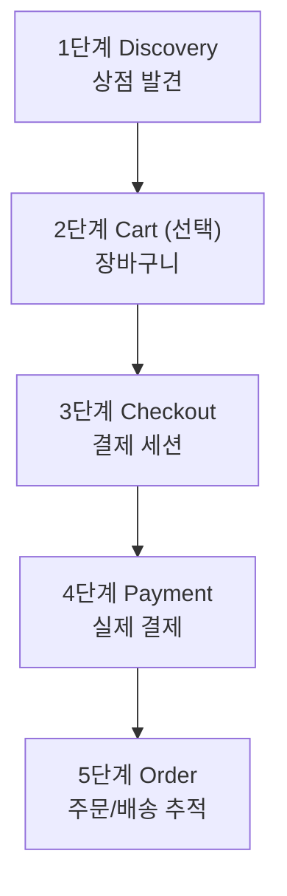
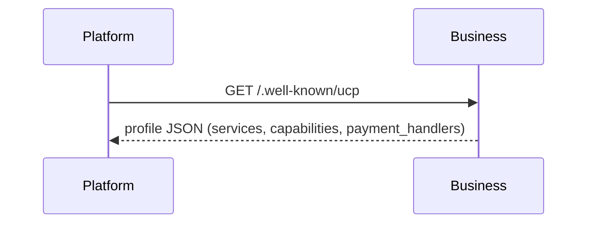
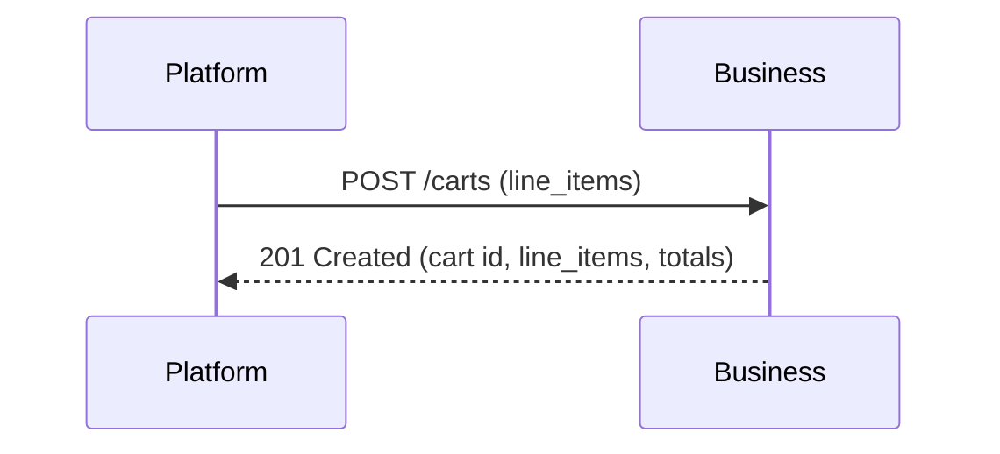
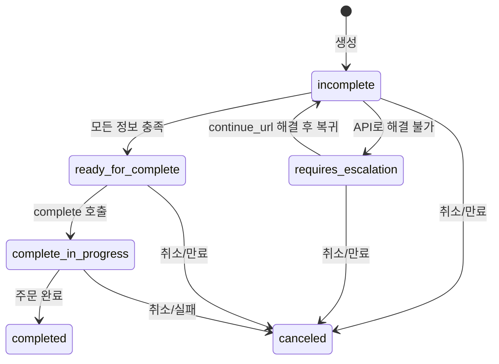
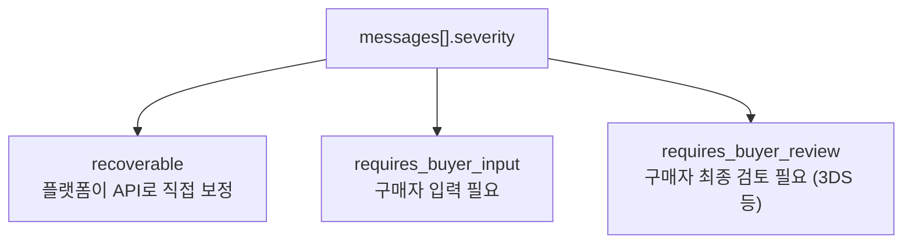
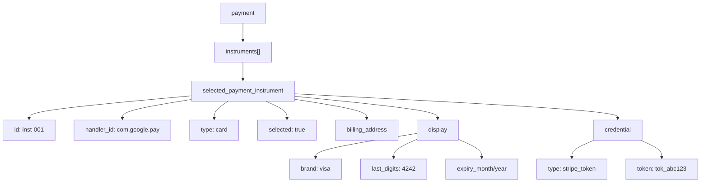
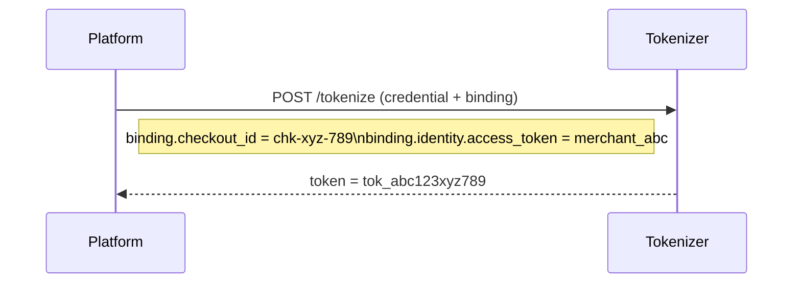
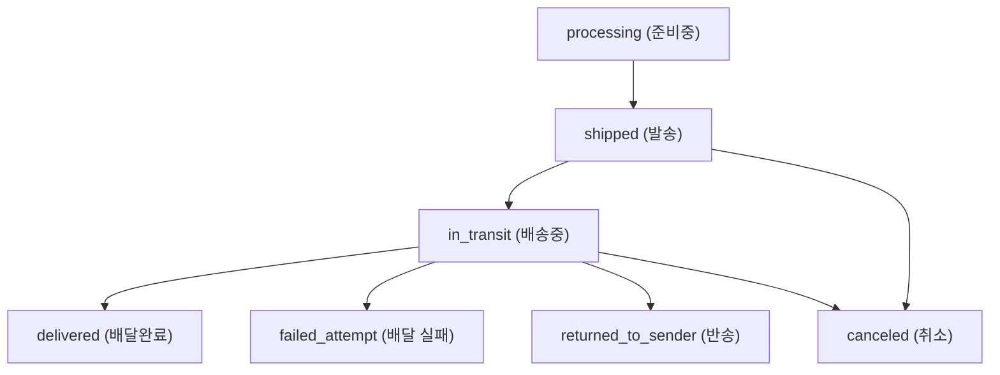
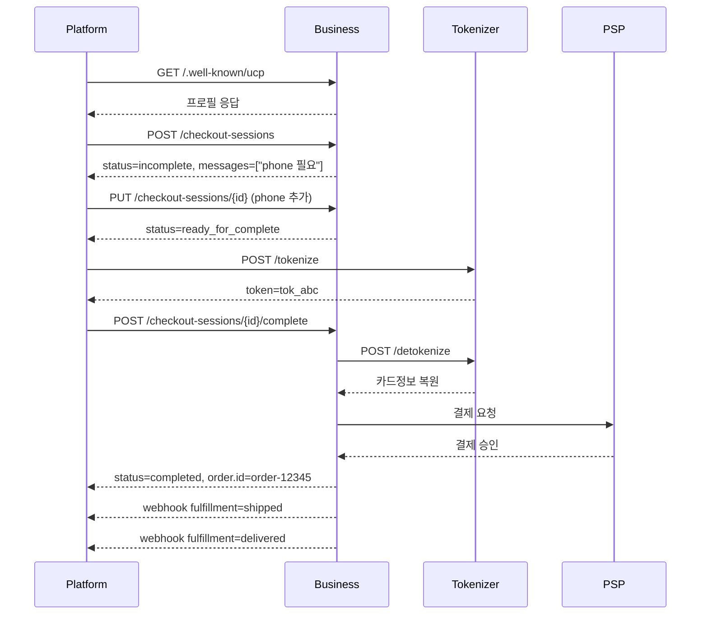

# 02. 결제 흐름 완전 해부

## 독해 가이드

- 이 문서의 목표:
Discovery -> Cart -> Checkout -> Payment -> Order의 운영 흐름을 이해한다.
- 지금 몰라도 되는 것:
토큰화 제공자 구현 내부, PSP 정산 내부
- 여기서 꼭 잡을 것:
Checkout 상태 전이와 `messages` 기반 복구 루프

## 전체 흐름 한눈에 보기



---

## 1단계: Discovery (상점 발견)



상점이 `/.well-known/ucp` 경로에 자기 프로필을 공개한다.
- 어떤 기능을 지원하는지 (Checkout, Cart, Order)
- 어떤 통신 방식을 쓰는지 (REST, MCP)
- 어떤 결제 수단을 받는지 (Google Pay, Stripe 등)

---

## 2단계: Cart (장바구니) - 선택 단계



- 결제 정보 없이 가볍게 탐색하는 단계
- 금액은 minor unit(센트 단위): `15000` = $150.00
- 나중에 `cart_id`로 Checkout으로 변환 가능

### Cart API

| 작업 | HTTP | 엔드포인트 |
|------|------|-----------|
| 생성 | `POST` | `/carts` |
| 조회 | `GET` | `/carts/{id}` |
| 수정 | `PUT` | `/carts/{id}` |
| 취소 | `POST` | `/carts/{id}/cancel` |

---

## 3단계: Checkout (결제 세션) - 핵심

### 3-1. Checkout 생성

> **Solana 구현 참고:** `buyer` 필드의 PII(이름, 이메일, 전화, 주소)는 Agent-local DB에 원본 저장되고,
> on-chain에는 SHA-256 해시만 기록된다. `complete_checkout` 시 주문별 ephemeral key로 암호화하여
> `EncryptedBuyerInfo PDA`에 임시 저장 → Merchant 수신 후 PDA 닫기.
> 상세: [02-data-mapping.md](../02-data-mapping.md#암호화된-pii-on-chain-저장-ephemeral-key--pda-closure)

```
Platform ──POST /checkout-sessions──→ Business
{
  "line_items": [{ "item": { "id": "shoe-123" }, "quantity": 2 }],
  "buyer": { "name": "홍길동", "email": "hong@example.com" },
  "context": { "country": "KR" }
}
```

응답:
```json
{
  "ucp": { "version": "2026-01-11", "payment_handlers": {} },
  "id": "chk-xyz-789",
  "status": "incomplete",
  "currency": "USD",
  "line_items": [],
  "totals": [
    { "type": "subtotal", "amount": 15000 },
    { "type": "tax", "amount": 1500 },
    { "type": "total", "amount": 16500 }
  ],
  "messages": [
    {
      "type": "error",
      "code": "missing",
      "path": "$.buyer.phone_number",
      "severity": "recoverable",
      "content": "Phone number is required"
    }
  ],
  "links": [
    { "rel": "terms_of_service", "href": "https://..." }
  ]
}
```

### 3-2. 상태 흐름 (가장 중요)



| 상태 | 의미 | 다음 행동 |
|------|------|----------|
| `incomplete` | 정보가 부족함 | `messages`를 읽고 Update로 보충 |
| `requires_escalation` | API로는 해결 불가 | `continue_url`로 구매자를 상점 UI로 보냄 |
| `ready_for_complete` | 모든 정보 충족 | Complete Checkout 호출 |
| `complete_in_progress` | 결제 처리 중 | 대기 |
| `completed` | 주문 완료 | Order 추적 단계로 |
| `canceled` | 세션 만료/취소 | 새 세션 생성 |

### 3-3. 에러 메시지 처리

`messages` 배열이 "뭐가 문제인지"를 정확히 알려준다.



에러 코드: `missing`, `invalid`, `out_of_stock`, `payment_declined`, `requires_3ds`, `requires_sign_in`

### 3-4. Update Checkout (반복)

**중요:** Update는 **전체 교체(Full Replacement)** 방식. 변경된 필드만이 아니라 전체 데이터를 다시 보냄.

### Checkout REST API

| 작업 | HTTP | 엔드포인트 |
|------|------|-----------|
| 생성 | `POST` | `/checkout-sessions` |
| 조회 | `GET` | `/checkout-sessions/{id}` |
| 수정 | `PUT` | `/checkout-sessions/{id}` |
| 완료 | `POST` | `/checkout-sessions/{id}/complete` |
| 취소 | `POST` | `/checkout-sessions/{id}/cancel` |

---

## 4단계: Payment (실제 결제)

### 4-1. 결제 수단 구조



### 4-2. 토큰화 (Tokenization)

카드번호를 직접 전송하지 않고 **토큰**으로 변환한다.



**Binding**: 토큰은 특정 checkout 세션 + 특정 상점에만 유효 (재사용 불가)

토큰 정책:
- **Single-use**: 한 번 쓰면 폐기 (가장 안전, 권장)
- **TTL-based**: 5~30분 후 만료 (재시도 허용)
- **Session-scoped**: 체크아웃 세션 동안 유효

### 4-3. Complete Checkout

```
Platform ──POST /checkout-sessions/{id}/complete──→ Business
{
  "payment": {
    "instruments": [{
      "id": "inst-001",
      "handler_id": "com.google.pay",
      "type": "card",
      "selected": true,
      "credential": {
        "type": "stripe_token",
        "token": "tok_abc123xyz789"
      },
      "billing_address": {...}
    }]
  }
}
```

상점 내부 처리:
1. 체크아웃 상태 검증 (ready_for_complete인지?)
2. 토큰 역토큰화 (detokenize) - binding 검증 포함
3. PSP에 결제 요청 (Stripe, Adyen 등)
4. 성공 시 주문 생성

> **Solana 구현 참고:** 토큰화가 불필요 (지갑 서명 = 결제 승인).
> complete_checkout 시 Agent가 PII를 ephemeral key로 암호화 → EncryptedBuyerInfo PDA 생성.
> Merchant는 자기 privkey로 ephemeral key를 복호화 → PII 획득 → 배송 처리 → PDA 닫기.

응답:
```json
{
  "status": "completed",
  "order": {
    "id": "order-12345",
    "permalink_url": "https://shop.example/orders/12345"
  }
}
```

---

## 5단계: Order (주문 추적)

상점이 플랫폼에 Webhook으로 이벤트를 push한다.

### 배송 이벤트



### 환불/반품 (Adjustment)

```json
{
  "type": "refund",        // refund, return, credit, dispute, cancellation
  "status": "completed",   // pending → completed / failed
  "amount": 7500,          // $75.00 환불
  "occurred_at": "2026-02-01T..."
}
```

---

## 전체 시퀀스 다이어그램



---

## 금액 계산 방식

모든 금액은 **minor unit** (최소 화폐 단위)로 표현:
- USD: $150.00 → `15000` (센트)
- KRW: ₩15,000 → `15000` (원 = 이미 최소 단위)

```
total = subtotal - discount + fulfillment + tax + fee
```
