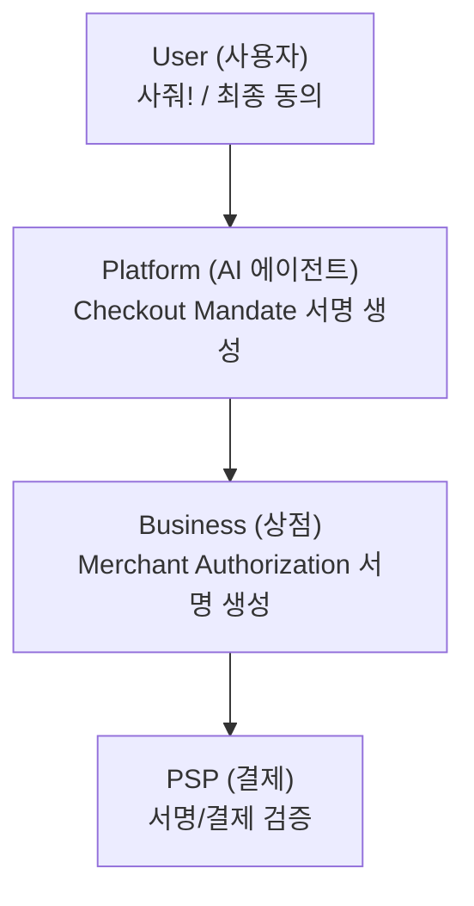
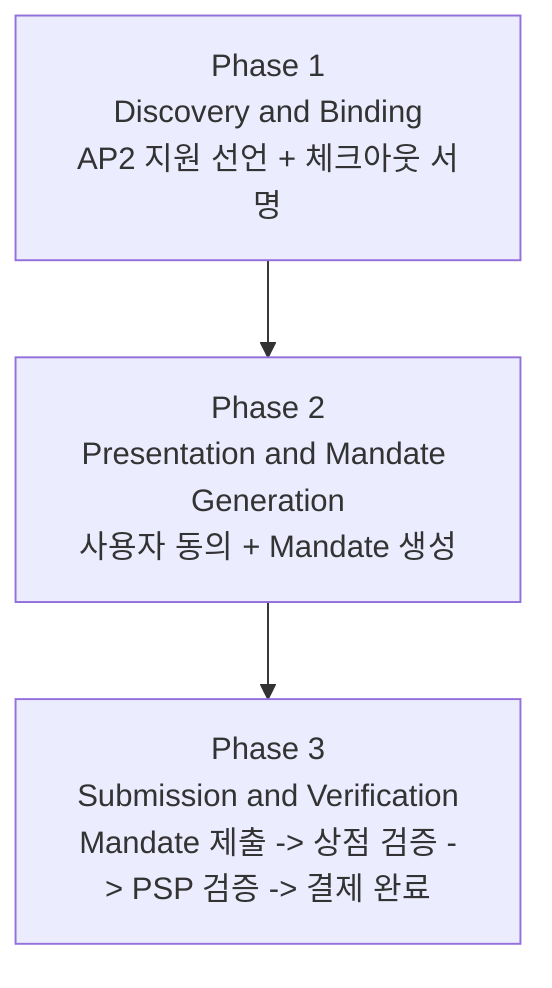
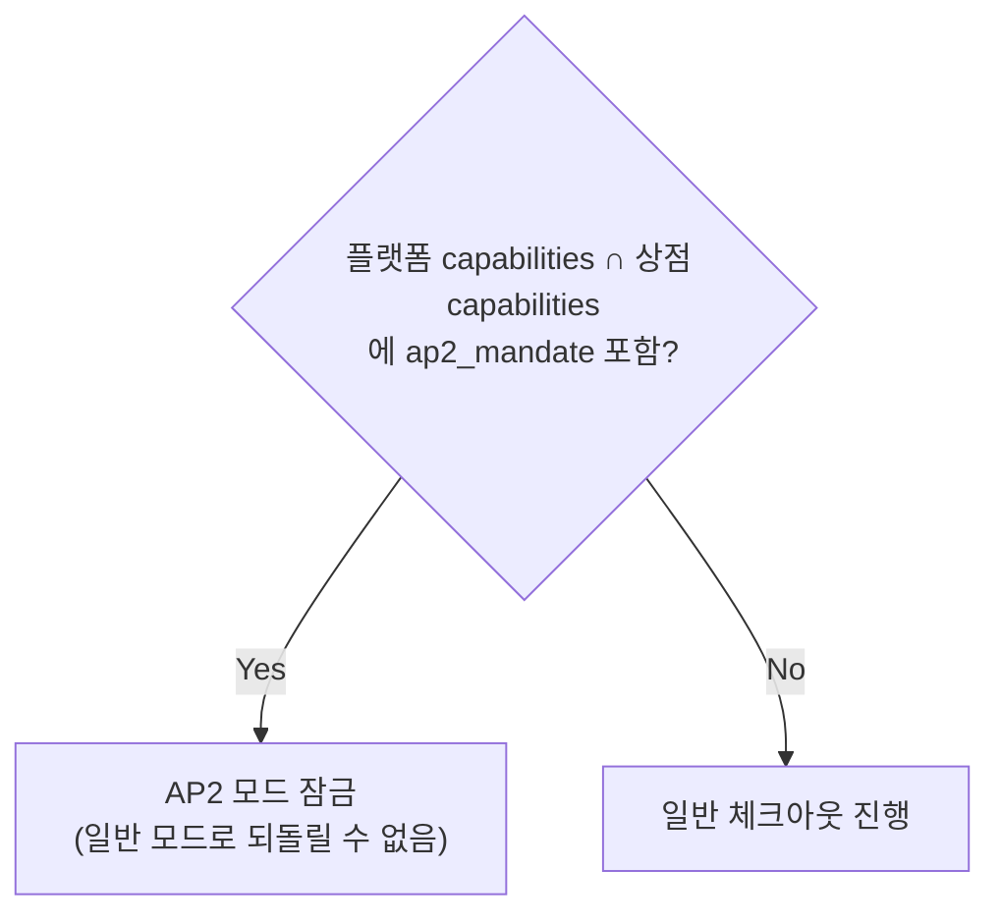
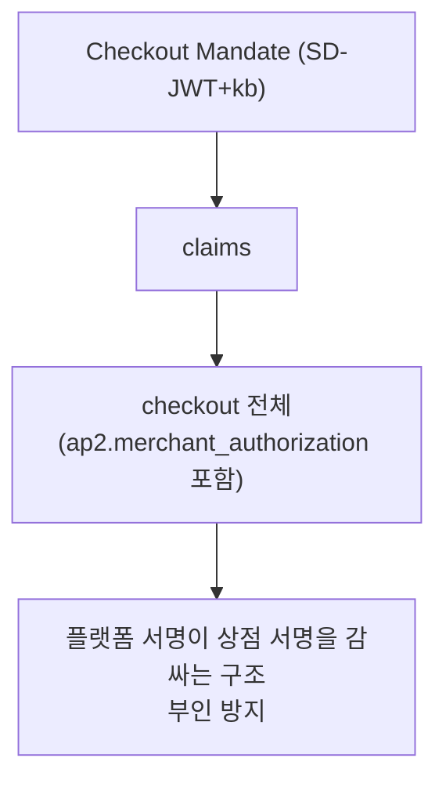
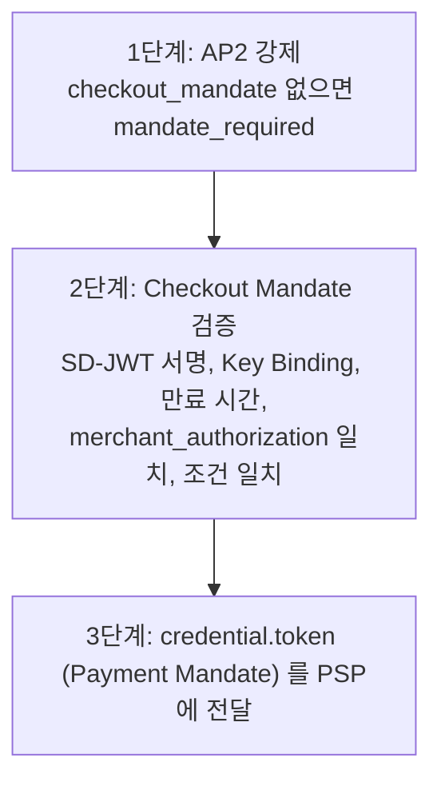
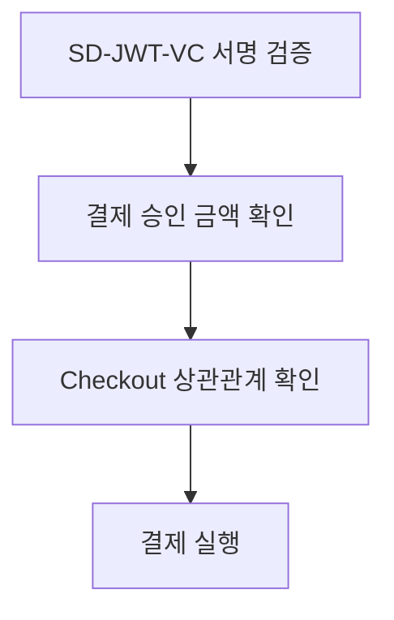

# 03. AP2 보안 결제 위임

## 독해 가이드

- 이 문서의 목표:
일반 checkout 대비 AP2가 추가로 보장하는 보안 성질을 이해한다.
- 지금 몰라도 되는 것:
JWS/SD-JWT의 모든 암호학 세부 수학
- 여기서 꼭 잡을 것:
merchant authorization + checkout/payment mandate의 결합 검증 구조

## AP2란?

**Agent Payments Protocol (AP2)** = AI 에이전트가 대신 결제할 때, 아무도 중간에서 금액을 바꾸거나 사기를 칠 수 없도록 **암호학적으로 보장**하는 프로토콜

### 왜 필요한가?

일반 UCP 체크아웃의 위험:
1. AI가 상점에서 "$50 운동화" 체크아웃 세션을 만듦
2. 중간에 누군가 금액을 "$500"으로 바꿈
3. AI는 모르고 결제를 진행함

AP2는 **암호화 서명**으로 이걸 방지한다:
- 상점이 "이 조건(가격, 상품)이 맞습니다"를 **서명**
- 사용자가 "이 조건에 동의합니다"를 **서명**
- 두 서명이 수학적으로 묶여서 **중간 변조가 불가능**

---

## 등장인물과 역할



---

## 전체 흐름 - 3단계



---

## Phase 1: Discovery & Binding

### 상점이 AP2 지원을 선언

```json
{
  "capabilities": {
    "dev.ucp.shopping.checkout": [{ "version": "2026-01-11" }],
    "dev.ucp.shopping.ap2_mandate": [{
      "version": "2026-01-11",
      "extends": "dev.ucp.shopping.checkout",
      "config": {
        "vp_formats_supported": { "dc+sd-jwt": {} }
      }
    }]
  }
}
```

### 세션 잠금 (Security Locked)



### 상점이 응답에 서명

```json
{
  "id": "chk_abc123",
  "status": "ready_for_complete",
  "currency": "USD",
  "line_items": [...],
  "totals": [
    { "type": "subtotal", "amount": 5000 },
    { "type": "tax", "amount": 400 },
    { "type": "total", "amount": 5400 }
  ],
  "ap2": {
    "merchant_authorization": "eyJhbGciOi...←헤더→..←서명→"
  }
}
```

**Detached JWS**: `header..signature` 형식 (점 두 개 = 페이로드 생략, 체크아웃 본문 자체가 페이로드)

### 서명 생성 과정

```
sign_checkout(checkout, private_key):
    1. ap2 필드를 제외한 체크아웃 본문 추출
    2. JCS(RFC 8785)로 정규화
    3. JWS 헤더 생성: { "alg": "ES256", "kid": "merchant_2025" }
    4. 서명 계산: ECDSA_sign(header + "." + canonical, private_key)
    5. Detached JWS 반환: base64url(header) + ".." + base64url(signature)
```

### 서명 알고리즘

| 알고리즘 | 설명 |
|---------|------|
| **ES256** | ECDSA P-256 + SHA-256 (**권장**) |
| ES384 | ECDSA P-384 + SHA-384 |
| ES512 | ECDSA P-521 + SHA-512 |

---

## Phase 2: Presentation & Mandate Generation

### 플랫폼이 상점 서명을 검증

```
verify_merchant_authorization(checkout, merchant_profile):
    1. Detached JWS 파싱: [header, "", signature]
    2. 알고리즘 검증: alg ∈ ["ES256", "ES384", "ES512"]
    3. 서명 대상 재구성: checkout에서 ap2 제거 → JCS 정규화
    4. 상점 공개키로 검증: verify(signature, signing_input, public_key)
```

### 사용자 동의 후 Mandate 2개 생성

| Mandate | 역할 | 누구를 보호? |
|---------|------|------------|
| **Checkout Mandate** | "이 체크아웃 조건에 동의합니다" | 상점 보호 |
| **Payment Mandate** | "이 금액의 결제를 승인합니다" | 사용자 자금 보호 |

### Mandate 생성 방식 2가지

**Option 1: Trusted Platform Provider**
- 플랫폼이 사용자 동의를 받고 자체 키로 서명
- 상점은 플랫폼의 서명 = 사용자 동의로 신뢰

**Option 2: Digital Payment Credential**
- 사용자의 디지털 지갑(은행 발급 VDC)이 직접 서명
- OpenID4VP 등으로 Wallet에 서명 요청
- 상점은 발급 기관(은행)을 신뢰하고 사용자 키 검증

### 중첩 암호화 바인딩



---

## Phase 3: Submission & Verification

### Complete Checkout 요청 (Mandate 포함)

```json
{
  "payment": {
    "instruments": [{
      "id": "instr_1",
      "handler_id": "gpay_1234",
      "type": "card",
      "selected": true,
      "credential": {
        "type": "PAYMENT_GATEWAY",
        "token": "← Payment Mandate가 여기에"
      }
    }]
  },
  "ap2": {
    "checkout_mandate": "eyJhbGciOi..."
  }
}
```

Mandate 위치:
- `ap2.checkout_mandate` → 체크아웃 위임장
- `payment.instruments[*].credential.token` → 결제 위임장

### 상점 검증 3단계



### PSP 검증



---

## 에러 코드

| 에러 코드 | 의미 |
|----------|------|
| `mandate_required` | AP2 협상했는데 Mandate가 없음 |
| `agent_missing_key` | 플랫폼 프로필에 signing_keys가 없음 |
| `mandate_invalid_signature` | 서명 검증 실패 |
| `mandate_expired` | Mandate 만료됨 |
| `mandate_scope_mismatch` | 다른 체크아웃에 묶인 Mandate |
| `merchant_authorization_invalid` | 상점 서명 검증 실패 |
| `merchant_authorization_missing` | 상점 서명이 없음 |

---

## 핵심 보안 속성

| 속성 | 설명 |
|------|------|
| **부인 방지** | 양쪽 모두 서명 → "동의 안 했다" 불가 |
| **변조 방지** | 금액/상품 바꾸면 서명 검증 실패 |
| **재사용 방지** | Mandate는 특정 checkout_id에 묶임 |
| **범위 제한** | Payment Mandate 금액 = Checkout 금액 (수학적 연결) |
| **시간 제한** | Mandate에 만료 시간(exp) 포함 |

---

## 일반 체크아웃 vs AP2 비교

| | 일반 체크아웃 | AP2 체크아웃 |
|---|---|---|
| 상점 응답 | 체크아웃 JSON만 | + `merchant_authorization` (서명) |
| Complete 요청 | `payment`만 | + `checkout_mandate` (위임장) |
| 결제 토큰 | 단순 토큰 | Payment Mandate (서명된 토큰) |
| 변조 가능? | 이론적 가능 | 불가능 (서명 깨짐) |
| 부인 가능? | 가능 | 불가능 (암호학적 증거) |

**비유:**
- 일반 체크아웃 = 구두 계약
- AP2 체크아웃 = 공증된 계약서 (모든 도장이 수학적으로 연결)
