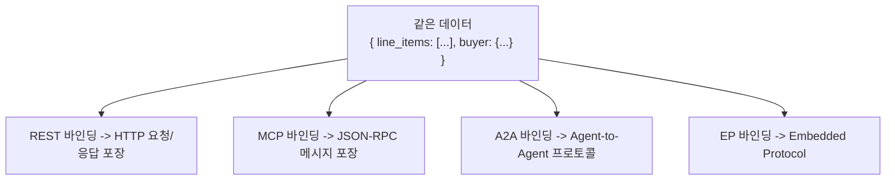
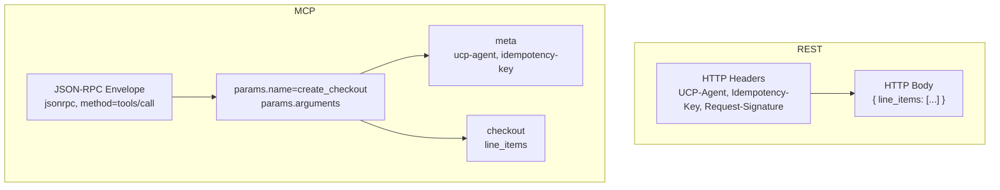

# 04. REST vs MCP 바인딩 상세 비교

## 독해 가이드

- 이 문서의 목표:
REST와 MCP가 "데이터는 같고 포장만 다르다"는 점을 명확히 한다.
- 지금 몰라도 되는 것:
OpenAPI/OpenRPC 문서 생성 도구 체인
- 여기서 꼭 잡을 것:
`meta`, `id`, `error` 매핑 규칙과 tool 호출 방식 차이

## "바인딩"이란?

UCP는 **데이터 구조**(checkout, cart, order)와 **통신 방식**(어떻게 전달하느냐)을 분리한다. 같은 데이터를 다른 방식으로 포장하는 것이 "바인딩"이다.



---

## 대상 사용자

| REST | MCP |
|------|-----|
| 전통적인 앱/웹사이트 | AI 에이전트 (LLM) |
| 모바일 앱 | Claude, GPT 등 |
| 서버 간 통신 | AI-native 플랫폼 |

---

## 핵심 차이 요약

| | REST | MCP |
|---|---|---|
| **프로토콜** | HTTP/HTTPS (OpenAPI 3.1) | JSON-RPC 2.0 (OpenRPC 1.3.2) |
| **호출 방식** | `POST /checkout-sessions` | `tools/call` → `create_checkout` |
| **리소스 식별** | URL 경로: `/checkout-sessions/{id}` | 파라미터: `"id": "chk_123"` |
| **메타데이터** | HTTP 헤더 | `meta` 객체 |
| **응답 구조** | JSON 본문 직접 반환 | `result.structuredContent` 안에 감싸서 반환 |
| **에러 처리** | HTTP 상태 코드 (400, 401, 404...) | JSON-RPC 에러 코드 (-32000) |
| **명세 파일** | `rest.openapi.json` | `mcp.openrpc.json` |

---

## 실제 비교: Create Checkout

### REST

```http
POST /checkout-sessions HTTP/1.1
UCP-Agent: profile="https://platform.example/profile"
Content-Type: application/json
Request-Signature: sig_xyz...
Idempotency-Key: 550e8400-e29b-41d4-a716-446655440000
Request-Id: 660f9500-f39c-51e5-b827-557766551111

{
  "line_items": [
    {
      "item": { "id": "item_123", "title": "Red T-Shirt", "price": 2500 },
      "id": "li_1",
      "quantity": 2
    }
  ]
}
```

### MCP

```json
{
  "jsonrpc": "2.0",
  "id": 1,
  "method": "tools/call",
  "params": {
    "name": "create_checkout",
    "arguments": {
      "meta": {
        "ucp-agent": {
          "profile": "https://platform.example/profile"
        },
        "idempotency-key": "550e8400-e29b-41d4-a716-446655440000"
      },
      "checkout": {
        "line_items": [
          { "item": { "id": "item_123" }, "quantity": 2 }
        ]
      }
    }
  }
}
```

### 구조 대비



---

## 응답 구조 비교

### REST 응답

```http
HTTP/1.1 201 Created
Content-Type: application/json

{
  "ucp": { "version": "2026-01-11" },
  "id": "chk_1234567890",
  "status": "incomplete",
  "line_items": [...],
  "totals": [...]
}
```

### MCP 응답

```json
{
  "jsonrpc": "2.0",
  "id": 1,
  "result": {
    "structuredContent": {
      "checkout": {
        "ucp": { "version": "2026-01-11" },
        "id": "chk_abc123",
        "status": "incomplete",
        "line_items": [...],
        "totals": [...]
      }
    },
    "content": [
      {
        "type": "text",
        "text": "{\"checkout\":{...}}"
      }
    ]
  }
}
```

**핵심 차이:** MCP는 두 가지 형태로 응답
- `structuredContent` → 기계가 처리하는 구조화 데이터
- `content` → LLM이 읽는 텍스트 표현

---

## 리소스 식별 방식

### REST - URL 경로

```
GET    /checkout-sessions/chk_123
PUT    /checkout-sessions/chk_123
POST   /checkout-sessions/chk_123/complete
POST   /checkout-sessions/chk_123/cancel
```

### MCP - 파라미터

```json
{ "name": "get_checkout",      "arguments": { "id": "chk_123" } }
{ "name": "update_checkout",   "arguments": { "id": "chk_123", "checkout": {} } }
{ "name": "complete_checkout", "arguments": { "id": "chk_123", "checkout": {} } }
{ "name": "cancel_checkout",   "arguments": { "id": "chk_123" } }
```

**MCP 규칙:** 요청의 `checkout` 객체에는 `id`를 넣지 않음. `id`는 별도 파라미터.

---

## 에러 처리

### REST

```
프로토콜 에러 → HTTP 상태 코드:
  401 Unauthorized, 403 Forbidden, 409 Conflict, 429 Rate Limit, 500 Error

비즈니스 결과 → 항상 HTTP 200 + messages 배열:
  "재고 부족", "이메일 필요" 등은 200 OK로 반환
```

### MCP

```
프로토콜 에러 → JSON-RPC error 객체:
  { "error": { "code": -32000, "message": "..." } }
  -32000 = 일반 프로토콜 에러
  -32001 = Discovery 에러

비즈니스 결과 → JSON-RPC result + messages (REST와 동일 구조)
```

---

## 메타데이터 매핑

| REST HTTP 헤더 | MCP meta 객체 |
|---------------|--------------|
| `UCP-Agent: profile="..."` | `meta.ucp-agent.profile: "..."` |
| `Idempotency-Key: uuid` | `meta.idempotency-key: "uuid"` |
| `Request-Signature: sig` | (별도 메커니즘) |
| `Authorization: Bearer tok` | (MCP 자체 인증) |
| `Request-Id: uuid` | `jsonrpc.id`로 대체 |

---

## 오퍼레이션 매핑

| 작업 | REST | MCP |
|------|------|-----|
| 체크아웃 생성 | `POST /checkout-sessions` | `create_checkout` |
| 체크아웃 조회 | `GET /checkout-sessions/{id}` | `get_checkout` |
| 체크아웃 수정 | `PUT /checkout-sessions/{id}` | `update_checkout` |
| 체크아웃 완료 | `POST /checkout-sessions/{id}/complete` | `complete_checkout` |
| 체크아웃 취소 | `POST /checkout-sessions/{id}/cancel` | `cancel_checkout` |
| 장바구니 생성 | `POST /carts` | `create_cart` |
| 장바구니 조회 | `GET /carts/{id}` | `get_cart` |
| 장바구니 수정 | `PUT /carts/{id}` | `update_cart` |
| 장바구니 취소 | `POST /carts/{id}/cancel` | `cancel_cart` |

---

## Discovery에서의 차이

```json
// REST 지원
{ "transport": "rest", "endpoint": "https://shop.example.com/ucp" }

// MCP 지원
{ "transport": "mcp", "endpoint": "https://shop.example.com/ucp/mcp" }

// 둘 다 지원
{
  "services": {
    "dev.ucp.shopping": [
      { "transport": "rest", "endpoint": "https://shop.example.com/ucp" },
      { "transport": "mcp",  "endpoint": "https://shop.example.com/ucp/mcp" }
    ]
  }
}
```

---

## 왜 MCP가 AI에 더 적합한가

MCP는 LLM의 Function Calling과 정확히 일치:

```
LLM: "체크아웃을 만들어야겠다"
  → tools/call: create_checkout
  → arguments: { meta, checkout }
  → result: { structuredContent + content }
```

REST로 하면 AI가 해야 하는 일:
1. URL 경로를 직접 구성
2. HTTP 메서드를 선택 (POST? PUT? GET?)
3. 11개 헤더를 정확히 조립
4. HTTP 상태 코드를 해석

MCP로 하면:
1. 도구 이름만 부르면 됨 ("complete_checkout")
2. 데이터를 arguments에 넣으면 끝
3. 결과를 structuredContent에서 읽으면 끝

---

## 핵심 요약

> REST와 MCP는 **포장 방식만 다르고, 안에 담기는 데이터와 비즈니스 로직은 100% 동일**하다. 상점은 자기 인프라에 맞는 바인딩을 선택하고, 플랫폼은 자기 특성에 맞는 바인딩을 선택한다.
