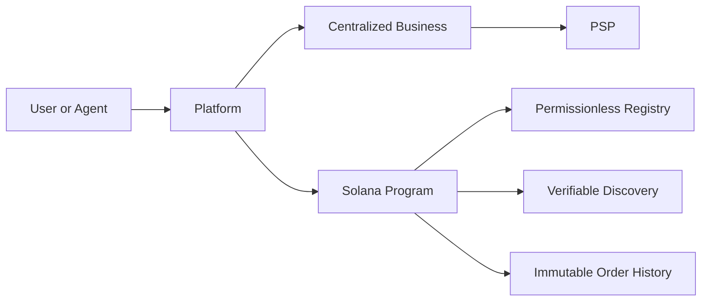
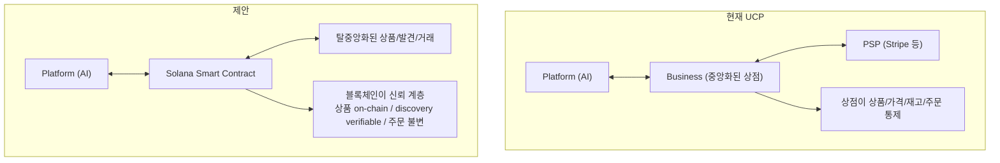
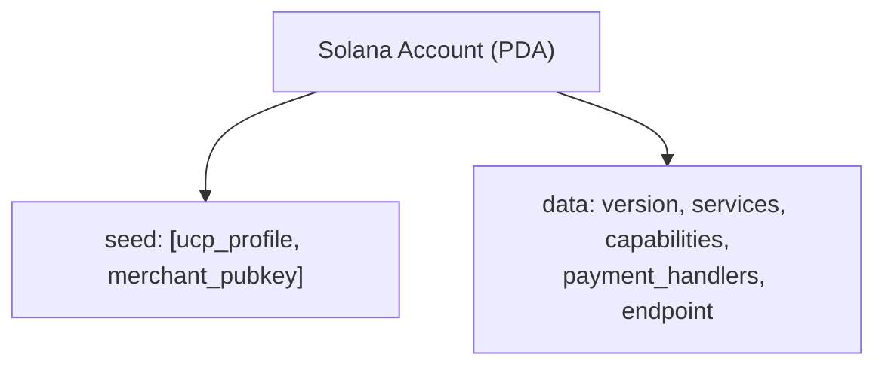
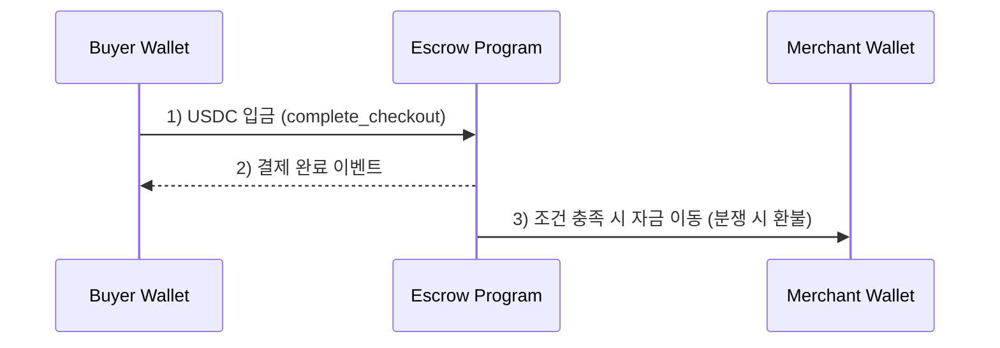
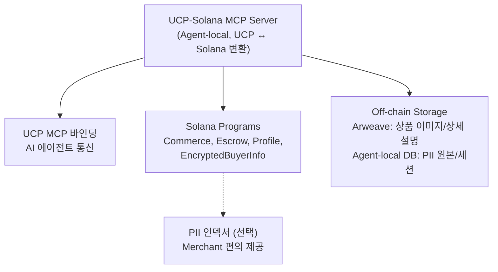
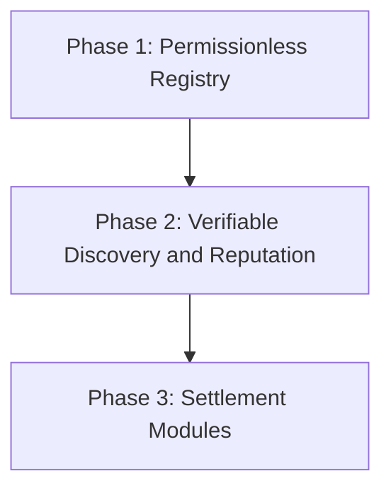
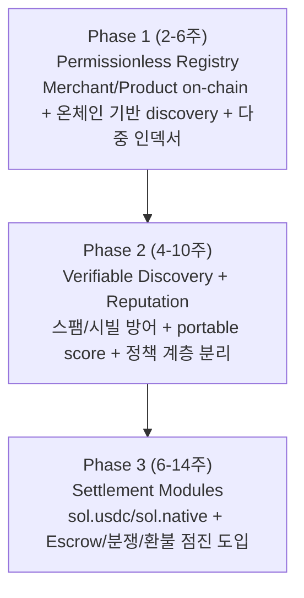

# Solana 블록체인 기반 탈중앙화 확장 설계안

> 다음 → [01-architecture.md](01-architecture.md)
>
## 독해 가이드

- 이 문서의 목표:
`왜 Solana로 가는지`와 `무엇을 우선 탈중앙화하는지`를 결정한다.
- 지금 몰라도 되는 것:
세부 Account 필드, instruction 단위 오류 처리
- 여기서 꼭 잡을 것:
`permissionless listing + verifiable discovery`가 1차 목표이고
결제는 2차 모듈이라는 우선순위

## 핵심 아이디어

현재 UCP의 중앙화된 구조를 Solana 블록체인의 스마트 컨트랙트로 탈중앙화한다.

이 기획의 최우선 목표는 결제 수단 교체가 아니라 다음 3가지다.
- 누구나 상점/상품을 등록할 수 있는 permissionless market
- UCP discovery를 통한 표준화된 상점/상품 탐색
- 온체인 데이터로 검증 가능한 신뢰(가격 이력, 상태 전이, 주문 이벤트)





---

## UCP 계층별 Solana 매핑

### 1. Discovery (상점 발견)

```
현재: GET https://shop.example/.well-known/ucp → 중앙 서버

Solana: 프로필을 Program Derived Address(PDA)에 저장
        → 누구도 임의로 삭제/차단할 수 없음 (탈중앙화)
```



**장점:** 검열 저항성, 가용성 보장

### 2. Product Catalog (상품 목록)

```
현재: 상점 DB에 저장, 상점이 맘대로 변경 가능

Solana: 각 상품 = Solana Account (PDA)
        → 가격 변경 이력이 블록체인에 투명하게 기록
```

```rust
#[account]
pub struct Product {
    pub merchant: Pubkey,          // 판매자 지갑 주소
    pub id: String,                // UCP item.id에 매핑
    pub title: String,             // 상품명
    pub price: u64,                // lamports 또는 USDC minor units
    pub currency: String,          // "USD" (UCP ISO 4217)
    pub stock: u32,                // 재고 수량
    pub active: bool,              // 판매 중 여부
    pub metadata_uri: String,      // 상세 정보 (Arweave/IPFS)
    pub created_at: i64,
    pub updated_at: i64,
}
```

### 3. Checkout Session (결제 세션)

```
현재: 체크아웃 세션 = 상점 서버의 메모리/DB
      → AP2로 방어하지만, 결국 중앙 서버 의존

Solana: 체크아웃 세션 = Solana Account (PDA)
        → 가격/조건이 on-chain에 기록되어 변조 불가
        → AP2 의존도를 낮춤 — 블록체인 자체가 신뢰 계층
```

```rust
#[account]
pub struct CheckoutSession {
    pub id: [u8; 32],              // 세션 ID
    pub buyer: Pubkey,             // 구매자 지갑
    pub merchant: Pubkey,          // 판매자 지갑
    pub status: CheckoutStatus,    // UCP 상태와 매핑
    pub line_items: Vec<LineItem>, // 상품 목록
    pub currency_mint: Pubkey,     // SPL 토큰 Mint (USDC 등)
    pub subtotal: u64,
    pub tax: u64,
    pub total: u64,
    pub escrow: Pubkey,            // 에스크로 계정 (결제 보호)
    pub created_at: i64,
    pub expires_at: i64,
}

#[derive(AnchorSerialize, AnchorDeserialize)]
pub enum CheckoutStatus {
    Incomplete,           // UCP "incomplete"
    RequiresEscalation,   // UCP "requires_escalation" (continue_url 필수)
    ReadyForComplete,     // UCP "ready_for_complete"
    CompleteInProgress,   // UCP "complete_in_progress"
    Completed,            // UCP "completed"
    Canceled,             // UCP "canceled"
}
```

### 4. Payment (결제)

```
현재: Platform → 토큰화 → 상점 → PSP(Stripe) → 카드사 → 은행
      (6단계, 수수료 2-3%)

Solana: Buyer Wallet → Escrow Program → Merchant Wallet
        (2-3단계, 수수료 ~0.00025 SOL ≈ $0.01)
```



**결제 수단 매핑:**

| UCP Payment Handler | Solana 대응 |
|---------------------|------------|
| `com.google.pay` | `sol.native` (SOL 직접 결제) |
| `com.stripe` | `sol.usdc` (USDC 스테이블코인) |
| `com.shopify.shop_pay` | `sol.spl_token` (임의 SPL 토큰) |
| 토큰화(Tokenization) | 불필요! 지갑 서명 = 결제 승인 |

### 5. Order (주문 추적)

```
현재: Webhook으로 상점 → 플랫폼 push
      → 상점이 허위 배송 완료 처리 가능

Solana: 주문 이벤트 = on-chain 트랜잭션 로그
        → 불변, 투명, 누구나 검증 가능
```

```rust
#[event]
pub struct OrderEvent {
    pub order_id: [u8; 32],
    pub event_type: FulfillmentEventType,  // shipped, delivered, refunded
    pub timestamp: i64,
    pub tracking_data: String,
}
```

---

## 전체 아키텍처



---

## 결정 사항 (확정)

1. 최종 목표는 **Full On-Chain Commerce**다.
2. 우선순위는 `등록 자유(permissionless listing) + discovery 신뢰(verifiable discovery)`다.
3. 결제는 registry/discovery와 분리된 모듈로 점진 연결한다.
4. UCP 호환성은 유지하되, `currency`는 ISO 4217 `USD`로 고정한다.
5. 토큰/체인 정보는 `currency_mint`와 `payment_handlers`에서 표현한다.
6. **MCP Server는 AI Agent 측에서 실행**한다 (중앙 서버 아님).
7. **Buyer PII는 주문별 ephemeral key로 암호화하여 on-chain에 임시 저장**, Merchant 수신 확인 후 PDA를 닫아 제거한다.

---

## 단계적 접근 추천





---

## UCP + Solana 시너지

기존에 불가능했던 것들:

### 1. AP2가 필요 없는 자연스러운 신뢰
블록체인 자체가 "누구도 변조 못함"을 보장.
암호학적 서명 = 지갑 서명으로 대체.
> 등록/발견/주문 이력이 온체인 검증 가능하므로 AP2 의존도를 낮춘다.
> → AP2 상세는 [concepts/03-ap2-security.md](concepts/03-ap2-security.md) 참조.

### 2. AI 에이전트의 자율 거래
AI에게 위임된 Solana 지갑 (Squads 멀티시그).
한도 내에서 자동 결제, 블록체인이 한도 강제.

### 3. 글로벌 즉시 정산
- Stripe: 2-7일 후 정산
- Solana: 400ms 후 정산, 국경 무관

### 4. 투명한 가격 이력
상품 가격 변경이 모두 on-chain.
AI가 "이 상품 어제보다 10% 올랐어요" 자동 감지.

### 5. Composability (조합성)
- DeFi + 커머스: "상품 구매 시 자동으로 스테이킹 보상 적용"
- NFT + 커머스: "한정판 상품 = NFT 소유권 증명"
