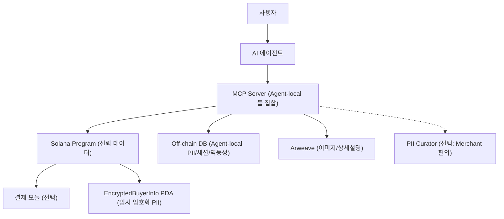
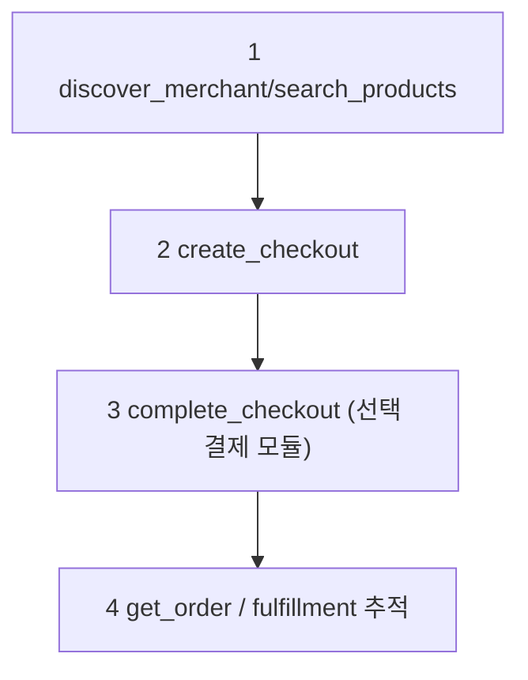
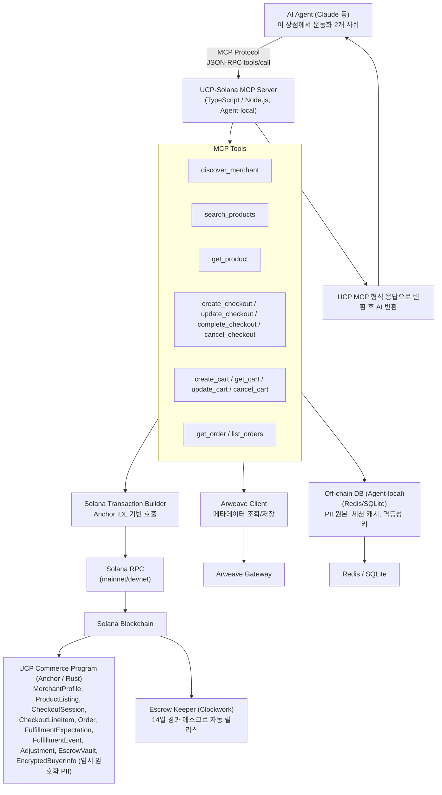

# Interlude: Registry-First On-Chain Commerce + MCP 래핑 — 아키텍처 개요

> 다음 → [02-data-mapping.md](02-data-mapping.md)
>
> 현재 버전: **v8 (2026-02-13)**

---

## TL;DR

1. Interlude 프로젝트의 핵심은 결제가 아니라 `permissionless listing + verifiable discovery`다.
2. 결제는 registry/discovery와 분리된 모듈로 취급한다.
3. 문서는 `개요(01~03) → 인터페이스/구현(04~07)` 순서로 읽는 것을 전제한다.

## 독해 가이드

- 이 문서의 목표:
시스템을 `AI -> MCP -> Solana` 흐름으로 한 번에 잡는 것
- 지금 몰라도 되는 것:
PDA별 필드, complete/update의 세부 오케스트레이션
- 여기서 꼭 잡을 것:
MCP는 tool set, Solana는 신뢰 상태 원장, 결제는 선택 모듈

## 3분 개념 지도 (처음 읽는 사람용)

- 이 시스템의 본체는 `Solana Program`이다. 상점/상품/주문의 "신뢰 데이터"는 여기에 기록된다.
- `MCP Server`는 AI Agent 측에서 실행되는 도구 인터페이스다. AI 요청을 받아 on-chain 조회/트랜잭션으로 변환한다. (중앙 서버 아님)
- `Off-chain DB`는 Agent 로컬에서 개인정보 원본/세션/멱등성 같은 운영 데이터를 저장한다.
- `Arweave`는 이미지/상세설명 같은 대용량 메타데이터를 저장한다.
- `Payment`는 붙일 수 있는 모듈이며, 핵심 가치(등록/탐색 신뢰)와 분리된다.

## 한 번에 보는 사용자 여정

## 문서 구조

| 문서 | 내용 |
|------|------|
| **01-architecture.md** (현재) | 기술 스택, 전체 아키텍처 |
| [02-data-mapping.md](02-data-mapping.md) | 데이터 경계/정합성 원칙 (코드 없는 설계) |
| [03-risk-register.md](03-risk-register.md) | 리스크 레지스터 (시장/기술/운영/거버넌스/규제) |
| [04-mcp-server.md](04-mcp-server.md) | MCP Server 설계 (discovery/조회 중심) |
| [05-solana-program.md](05-solana-program.md) | Solana Program 설계 (Account, Instructions, 상태 전이) |
| [06-payment-handler.md](06-payment-handler.md) | `sol.usdc` Payment Handler 정의 |
| [07-implementation-plan.md](07-implementation-plan.md) | 구현 로드맵, KPI 게이트, 배포 계획 |
| [08-pocket.md](08-pocket.md) | Pocket (구매자 MCP 서비스) 설계 |

---

## 기술 스택

| 계층 | 기술 | 역할 |
|------|------|------|
| AI 에이전트 | Claude, GPT 등 | 사용자 대신 쇼핑 수행 |
| MCP Server | TypeScript / Node.js | UCP MCP 도구 → Solana 트랜잭션 변환 (Agent-local) |
| Off-chain DB | Redis / SQLite | 개인정보 원본, 세션 캐시, idempotency 저장 (Agent-local) |
| Blockchain | Solana + Anchor (Rust) | 커머스 로직 on-chain 실행 |
| 결제 모듈 | USDC/SOL (SPL Token) | discovery/등록 계층과 분리된 선택형 settlement |
| 메타데이터 | Arweave | 상품 이미지, 상세 설명 영구 저장 |
| 크랭커 | Clockwork / 자체 Keeper | 에스크로 자동 릴리스 트리거 |

---

## 상세 아키텍처 (구성요소 전체)

---

## 변경 이력

- **v8 (2026-02-13)**: 방향성 재정렬 (permissionless listing + verifiable discovery 우선)
- **v7.1 (2026-02-13)**: 문서 분할 후 교차 일관성 검토 반영
- **v7 (2026-02-12)**: 8차 검토 완료, 0 issues
- **v2**: CheckoutStatus 6개 상태, currency ISO 4217, Order/Fulfillment 전면 보강, LineItem 별도 PDA, 개인정보 off-chain, 크랭커 설계, payment 인터페이스, context/fulfillment_method, idempotency
- **v7 세부**: create_checkout에서 is_digital_only=true 초기화, add_line_item에서 AND 연산 (is_digital_only && product.is_digital())
- **v6 세부**: fulfillment_types 인코딩 통일, MANAGED_MASK 0x007F→0x005F, reevaluate_status에 phone_hash 검사 추가, UcpMessage.code 선택적 허용
- **v5 세부**: 외부 플래그 보존(MANAGED_MASK), is_digital_only 추가, error_flags 레이아웃 명확화, tax_inclusive 분기 통일
- **v4 세부**: checkout fulfillment 확장 미선언, Order line_items quantity 객체화, error_flags 0x0008→0x0080 분리, Cart meta 필수화
- **v3 세부**: 하이브리드 Totals 계산, FulfillmentExpectation PDA 분리, update_checkout 오케스트레이션, 다중 TX 부분 실패 복구 전략
