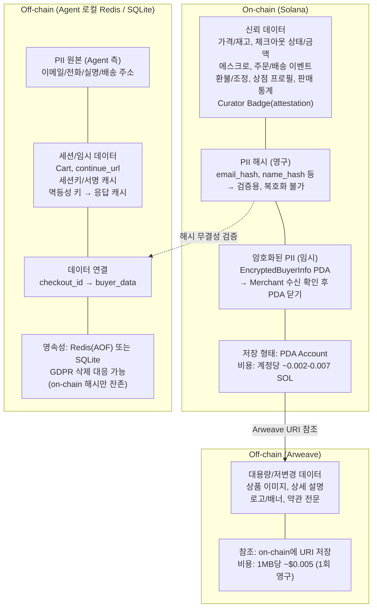
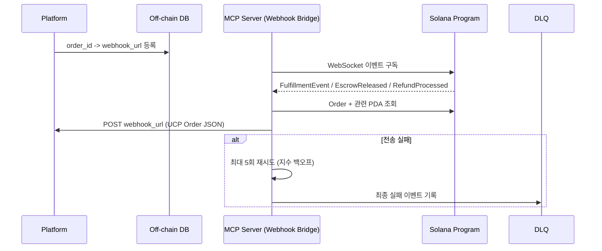
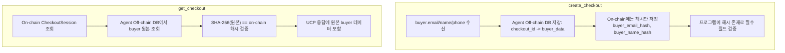
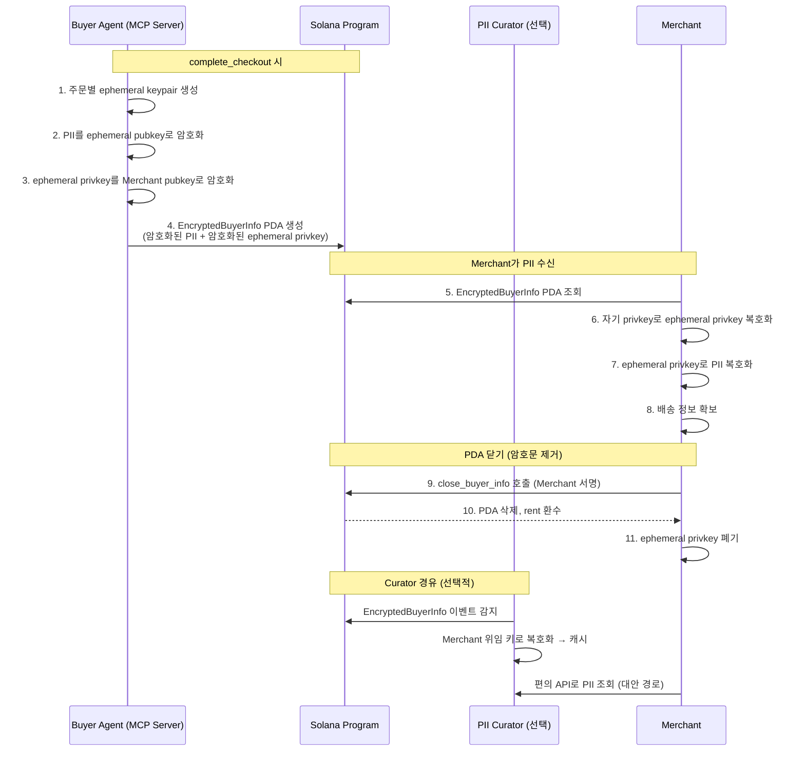
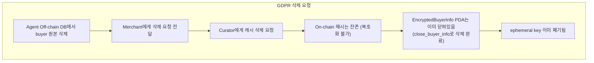

# 데이터 흐름 및 UCP 호환성 매핑

> [01-architecture.md](01-architecture.md) ← 이전 | 다음 → [03-risk-register.md](03-risk-register.md)

---

## 독해 가이드

- 이 문서의 목표:
데이터를 어디에 두는지(on-chain/off-chain)와 그 이유를 합의한다.
- 지금 몰라도 되는 것:
각 UCP 필드의 완전 매핑 디테일
- 여기서 꼭 잡을 것:
신뢰 데이터는 on-chain, PII 원본은 off-chain, 해시로 무결성 연결

## 데이터 계층 원칙 (Registry-first)

1. 상점/상품 discovery에 필요한 데이터 정합성을 최우선으로 유지한다.
2. 신뢰가 필요한 최소 데이터만 on-chain에 두고, 대용량/민감 데이터는 off-chain에 둔다.
3. payment 필드는 선택형 모듈로 취급하며 registry/discovery 계층과 분리한다.
4. **PII는 주문별 임시 키로 암호화하여 on-chain에 임시 저장하고, Merchant 수신 확인 후 PDA를 닫는다.**
5. **PII 암호문의 on-chain 노출 기간을 최소화하여 미래 키 유출 위험을 줄인다.**
6. **Curator Badge(attestation)는 on-chain에 저장하여 AI Agent가 즉시 검증 가능하게 한다.** Curator가 직접 TX에 서명하므로 Merchant 위조 불가.

---

## On-chain vs Off-chain 데이터 분리



### MCP Server 운영 주체

MCP Server는 AI Agent 측에서 실행되며, Off-chain DB도 Agent 로컬에 위치한다.
따라서 **별도 중앙 서버 운영자가 불필요**하다.

```
AI Agent (각자 자기 것)
├── MCP Server        ← Agent가 직접 실행
├── Off-chain DB      ← Agent 로컬 (Redis/SQLite)
└── Arweave Client    ← 조회만

공유 인프라 (운영자 없음)
├── Solana            ← 퍼블릭 블록체인
├── Arweave           ← 퍼블릭 영구 저장
└── PII Curator (선택) ← 복수 운영 가능, Merchant 편의 제공
```

### Merchant에게 PII를 전달하는 방법

Merchant는 on-chain에 해시만으로는 실제 배송 주소를 알 수 없다.
이를 해결하기 위해 **주문별 임시 키 + PDA 닫기 패턴**을 사용한다.

- `complete_checkout` 시 PII를 주문별 ephemeral key로 암호화하여 `EncryptedBuyerInfo PDA`에 저장
- Merchant(또는 PII Curator)가 복호화하여 수신
- 수신 확인 후 PDA를 닫아 on-chain에서 암호문 제거
- 상세 설계는 아래 [암호화된 PII On-chain 저장 (Ephemeral Key + PDA Closure)](#암호화된-pii-on-chain-저장-ephemeral-key--pda-closure) 참조

## Order Webhook 브릿지

UCP는 상점이 `webhook_url`로 주문 이벤트를 Platform에 push하는 패턴을 사용한다.
Solana에서는 on-chain 이벤트를 감지하여 webhook으로 변환하는 브릿지가 필요하다.



## MCP 프로토콜 에러 처리

UCP MCP 스펙에 따른 프로토콜 에러 (비즈니스 에러와 구분):

```typescript
// 프로토콜 에러 → JSON-RPC error 객체로 반환
// 비즈니스 에러 → JSON-RPC result + messages 배열로 반환 (정상 응답)

function buildProtocolError(code: number, message: string) {
  return {
    jsonrpc: "2.0",
    id: requestId,
    error: { code, message }
  };
}

// 에러 코드 매핑
const MCP_ERRORS = {
  // Discovery/프로필 에러
  DISCOVERY_ERROR: -32001,     // 상점 프로필 조회 실패, 프로필 형식 오류

  // 일반 프로토콜 에러
  PROTOCOL_ERROR: -32000,      // 인증 실패, 권한 없음, 멱등성 충돌, 속도 제한

  // 서버 내부 에러
  INTERNAL_ERROR: -32603,      // Solana RPC 실패, 예상치 못한 오류
};

// 사용 예시:
// 1. MerchantProfile PDA 없음 → -32001 (discovery error)
// 2. Buyer 서명 누락 → -32000 (auth error)
// 3. 같은 idempotency-key로 다른 checkout에 complete → -32000 (conflict)
// 4. Solana RPC 타임아웃 → -32603 (internal error)
// 5. 재고 부족 → 200 OK + messages[{ code: "out_of_stock" }] (비즈니스 에러)
```

## Buyer PII 관리 흐름

### Checkout 단계 (Agent 측)



### 주문 완료 단계 (PII를 Merchant에게 전달)



### GDPR 삭제



---

## 암호화된 PII On-chain 저장 (Ephemeral Key + PDA Closure)

### 설계 동기

| 문제 | 설명 |
|------|------|
| MCP Server가 Agent 측에 있음 | Merchant가 Agent의 Off-chain DB에 직접 접근 불가 |
| Agent 오프라인 가능성 | Buyer가 주문 후 에이전트를 종료할 수 있음 |
| 탈중앙화 유지 | Merchant에게 별도 서버 운영을 강제하지 않음 |
| 보안 | on-chain에 PII 평문 저장 불가, 영구 암호문도 위험 |

### 핵심 원칙

1. **on-chain 암호문은 임시**: Merchant 수신 확인 후 PDA를 닫아 active state에서 제거
2. **주문별 임시 키**: Merchant 장기 키 유출 시에도 이미 폐기된 ephemeral key로 과거 PII 복호화 불가
3. **이중 방어**: ephemeral key + PDA closure 두 계층으로 보안 확보

### PII 전달 상세 흐름

```
complete_checkout 시 (Agent 측):
  1. ephemeral_keypair = Keypair::generate()
  2. encrypted_pii = encrypt(pii_json, ephemeral_keypair.pubkey)
  3. encrypted_ephemeral_privkey = encrypt(ephemeral_keypair.privkey, merchant.pubkey)
  4. Solana TX: EncryptedBuyerInfo PDA 생성
     {
       order: order_pda,
       encrypted_pii,
       encrypted_ephemeral_key: encrypted_ephemeral_privkey,
       ephemeral_pubkey: ephemeral_keypair.pubkey,
     }

Merchant 수신:
  5. EncryptedBuyerInfo PDA 조회 (on-chain)
  6. ephemeral_privkey = decrypt(encrypted_ephemeral_key, merchant.privkey)
  7. pii_json = decrypt(encrypted_pii, ephemeral_privkey)
  8. 배송 정보 확보 → 자체 DB에 저장

PDA 닫기:
  9. close_buyer_info instruction 호출 (Merchant 서명)
  10. PDA 삭제, rent → Merchant에게 환수
  11. Merchant가 ephemeral_privkey 폐기
```

### 시간축과 노출 구간

```
주문 ──── 배송준비 ──── 배송완료 ──── PDA 닫기
  │                                    │
  ├─ EncryptedBuyerInfo on-chain ──────┤
  │      (노출 구간: 수일~수주)          │
  │                                    └─ PDA 닫힘, active state에서 제거
  │
  └─ CheckoutSession.buyer_*_hash ──────────────── 영구 잔존 (해시만, 복호화 불가)
```

### 위협 분석

| 공격 시나리오 | ephemeral key만 | PDA closure만 | **둘 다 적용** |
|---------------|-----------------|---------------|----------------|
| Merchant 장기 키 유출 | ephemeral key 이미 폐기 → **안전** | PDA 닫혀있으면 암호문 없음 → **안전** | **이중 방어** |
| Ledger 히스토리 스캔 | ephemeral key 없이 복호화 불가 → **안전** | 닫힌 PDA는 active state에 없음 | **이중 방어** |
| PDA 닫기 전 탈취 | Merchant 장기 키 + ephemeral key 동시 필요 → **난이도 높음** | 아직 열려있어 조회 가능 | ephemeral key 보호 |
| Curator 해킹 | 위임 키 범위만 노출 | Curator 캐시만 위험 | on-chain과 분리 |

### 잔존 위험과 수용 범위

- **PDA가 열려 있는 기간** (수일~수주): ephemeral privkey + Merchant 장기 키가 동시에 유출되어야 복호화 가능. 현실적 위험도 매우 낮음.
- **과거 ledger 히스토리**: Validator pruning 대상. Archival node에 남을 수 있지만 ephemeral key 이미 폐기되어 복호화 불가.
- **Merchant가 PDA를 안 닫는 경우**: 인센티브 설계로 대응 (rent 환수 = 경제적 동기). 필요 시 TTL 강제 (keeper가 일정 기간 후 자동 close).

### PII Curator (선택적 보조 계층)

Merchant가 직접 on-chain PDA를 읽고 복호화할 수 있지만,
운영 편의를 위해 **PII Curator**를 선택적으로 활용할 수 있다.

```
Curator 역할:
├── on-chain EncryptedBuyerInfo 이벤트 감지
├── Merchant 위임 키로 복호화 → 운영 DB에 캐시
├── Merchant에게 조회 API 제공 (배송지, 고객 목록, 검색)
├── GDPR 삭제 요청 시 캐시에서 삭제
└── Webhook 브릿지 역할 병행 가능

Curator 장애 시 fallback:
├── Merchant가 Solana PDA 직접 조회 → 자기 키로 복호화
└── on-chain이 원본이므로 데이터 유실 없음

탈중앙화:
├── 복수 Curator 운영 가능 (경쟁/선택)
├── Merchant가 Curator를 자유롭게 선택/변경
├── 프로토콜은 Curator에 중립
└── 특정 Curator에 종속되지 않음
```

---

## UCP 호환성 매핑 테이블

### Checkout 필드 매핑

| UCP 필드 | Solana 소스 | 변환 |
|----------|------------|------|
| `ucp.version` | 하드코딩 | `"2026-01-11"` |
| `ucp.capabilities` | MerchantProfile.supports_* | bool → capability 배열 |
| `ucp.payment_handlers` | 하드코딩 + MerchantProfile | 결제 모듈 정보 (예: sol.usdc) |
| `id` | CheckoutSession.checkout_id | bytes → hex string `"chk_"` prefix |
| `status` | CheckoutSession.status | enum → string (6개 상태) |
| `currency` | `"USD"` (고정) | USDC = USD 기반 스테이블코인, ISO 4217 |
| `line_items[].id` | CheckoutLineItem.index | `"li_"` + index |
| `line_items[].item.id` | CheckoutLineItem.product_id | 직접 매핑 |
| `line_items[].item.title` | CheckoutLineItem.title | 직접 매핑 |
| `line_items[].item.price` | CheckoutLineItem.unit_price | 직접 매핑 |
| `line_items[].item.image_url` | ProductListing.image_uri | Arweave URI |
| `line_items[].quantity` | CheckoutLineItem.quantity | u32 → int |
| `line_items[].totals` | 계산 | unit_price × quantity |
| `totals[].type` | 개별 필드 매핑 | subtotal/discount/fulfillment/tax/fee/total |
| `totals[].amount` | CheckoutSession.subtotal 등 | 직접 매핑 (0인 항목은 생략) |
| `totals[].display_text` | MerchantProfile or 하드코딩 | 선택적 |
| `buyer.email` | Off-chain DB (원본) | 해시 검증 후 반환 |
| `buyer.first_name` | Off-chain DB (원본) | 해시 검증 후 반환 |
| `buyer.last_name` | Off-chain DB (원본) | 해시 검증 후 반환 |
| `buyer.phone_number` | Off-chain DB (원본) | 해시 검증 후 반환 |
| `context.country` | CheckoutSession.buyer_country | 2-byte → string |
| `context.language` | CheckoutSession.buyer_language | 2-byte → string |
| `messages` | CheckoutSession.error_flags | 비트 플래그 → Message[] |
| `links` | MerchantProfile.*_url | URL 필드 → Link[] |
| `expires_at` | CheckoutSession.expires_at | i64 → RFC 3339 |
| `continue_url` | Off-chain DB | status == RequiresEscalation 시만 포함 |
| `payment` | sol.usdc 핸들러 정보 | 자동 구성 |
| `order.id` | Order.order_id | bytes → hex string `"ord_"` prefix |
| `order.permalink_url` | 생성 | Solana explorer 또는 커스텀 URL |

### Order 필드 매핑

| UCP 필드 | Solana 소스 | 변환 |
|----------|------------|------|
| `id` | Order.order_id | bytes → hex string |
| `checkout_id` | Order.checkout_id | bytes → hex string |
| `permalink_url` | 생성 | Solana explorer URL |
| `line_items[].quantity` | CheckoutLineItem.quantity + FulfillmentEvent 집계 | `{ total: u32, fulfilled: u32 }` 객체로 변환 |
| `line_items[].status` | FulfillmentEvent 집계 | `"processing"` / `"partial"` / `"fulfilled"` |
| `line_items` | CheckoutLineItem[] PDA | 불변 스냅샷 |
| `totals` | Order.subtotal/tax/... | 개별 필드 → Total[] |
| `fulfillment.expectations` | FulfillmentExpectation[] PDA + EncryptedBuyerInfo 또는 Curator | 배열, destination은 Merchant가 복호화한 PII에서 복원 |
| `fulfillment.events` | FulfillmentEvent[] PDA | append-only 이벤트 목록 |
| `adjustments` | Adjustment[] PDA | append-only 조정 목록 |

### messages 생성 로직 (확장)

```typescript
// error_flags 비트 레이아웃:
// bit 0-15:  errors   (type: "error")
// bit 16-23: warnings (type: "warning")
// bit 24-31: info     (type: "info")

interface UcpMessage {
  type: "error" | "warning" | "info";
  code?: string;                    // error/warning: 필수, info: 선택
  path?: string;
  severity?: "recoverable" | "requires_buyer_input" | "requires_buyer_review";
                                    // error: 필수, warning/info: 없음
  content: string;
  content_type?: "plain" | "markdown";
}

function errorFlagsToMessages(flags: number): UcpMessage[] {
  const messages: UcpMessage[] = [];

  // === Errors (bit 0-15) ===
  if (flags & 0x0001) messages.push({
    type: "error", code: "missing",
    path: "$.buyer.email", severity: "recoverable",
    content: "Buyer email is required"
  });

  if (flags & 0x0002) messages.push({
    type: "error", code: "missing",
    path: "$.buyer.first_name", severity: "recoverable",
    content: "Buyer name is required"
  });

  if (flags & 0x0004) messages.push({
    type: "error", code: "missing",
    path: "$.fulfillment", severity: "recoverable",
    content: "Shipping address is required"
  });

  if (flags & 0x0008) messages.push({
    type: "error", code: "missing",
    path: "$.line_items", severity: "recoverable",
    content: "At least one line item is required"
  });

  if (flags & 0x0010) messages.push({
    type: "error", code: "missing",
    path: "$.buyer.phone_number", severity: "recoverable",
    content: "Phone number is required"
  });

  if (flags & 0x0020) messages.push({
    type: "error", code: "payment_declined",
    path: "$.payment", severity: "recoverable",
    content: "Insufficient USDC balance"
  });

  if (flags & 0x0040) messages.push({
    type: "error", code: "requires_sign_in",
    path: "$.buyer", severity: "requires_buyer_input",
    content: "Buyer must connect their Solana wallet"
  });

  if (flags & 0x0080) messages.push({
    type: "error", code: "out_of_stock",
    path: "$.line_items", severity: "recoverable",
    content: "One or more items are out of stock"
  });

  // === Warnings (bit 16-23) ===
  if (flags & 0x010000) messages.push({
    type: "warning", code: "final_sale",
    path: "$.line_items",
    content: "This item is final sale and cannot be returned"
  });

  if (flags & 0x020000) messages.push({
    type: "warning", code: "fulfillment_changed",
    path: "$.fulfillment",
    content: "Shipping method has been updated"
  });

  if (flags & 0x040000) messages.push({
    type: "warning", code: "price_changed",
    path: "$.line_items",
    content: "Product price has changed since cart was created"
  });

  // === Info (bit 24-31) ===
  if (flags & 0x01000000) messages.push({
    type: "info",
    content: "Free shipping on orders over $50!"
  });

  if (flags & 0x02000000) messages.push({
    type: "info", code: "loyalty_points",
    content: "You will earn 100 loyalty points with this purchase"
  });

  return messages;
}
```
