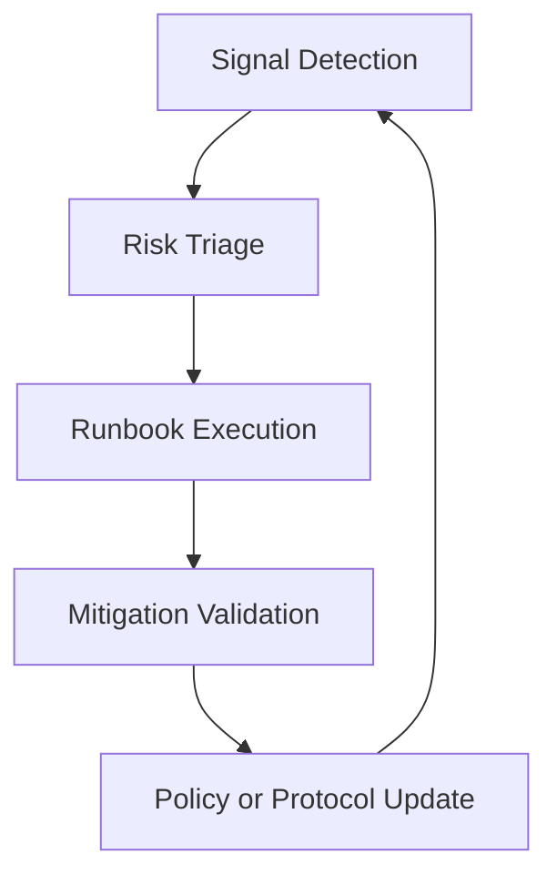

# 리스크 레지스터 (Decentralized Commerce Registry)

> [02-data-mapping.md](02-data-mapping.md) ← 이전 | 다음 → [04-mcp-server.md](04-mcp-server.md)
>
> 이 문서는 `등록 자유 + discovery 신뢰 + 검열 저항` 목표를 기준으로 관리한다.

---

## 독해 가이드

- 이 문서의 목표:
아키텍처를 운영 가능한 시스템으로 바꾸는 리스크 기준을 정한다.
- 지금 몰라도 되는 것:
모든 runbook의 즉시 실행 절차
- 여기서 꼭 잡을 것:
프로토콜 레벨과 Curator/UI 정책 레벨의 책임 분리

## 관리 원칙

1. 리스크는 제거보다 완화가 기본이다.
2. 프로토콜 레벨과 Curator/UI 레벨의 책임을 분리한다.
3. 각 리스크는 `지표(Trigger)`와 `즉시 조치(Runbook)`를 반드시 가진다.

---

## 리스크 목록

| ID | 리스크 | 심각도 | Trigger (관측 신호) | 대응 전략 | 소유 |
|----|--------|--------|---------------------|-----------|------|
| R-01 | 상품/상점 스팸 등록 폭증 | High | 신규 등록 급증, 신고율 급증 | staking/deposit, rate limit, Curator 필터, **인증 없는 Merchant 자연 하위 노출** | Protocol + Indexer |
| R-02 | 시빌 공격으로 평판 왜곡 | High | 동일 패턴 계정군 상호 리뷰 | portable reputation + 신뢰 그래프 + 가중치, **Curator Badge(attestation) 기반 판매자 신뢰 검증** | Trust Layer |
| R-03 | 검색 Curator 중앙화 | High | 특정 Curator 의존도 과다 | 다중 Curator, 클라이언트 선택 라우팅, **Curator 간 경쟁적 Badge 생태계 (CA 모델)** | Discovery Infra |
| R-04 | 불법/사기 상품 노출 | High | 법적 요청/사용자 피해 신고 | 프로토콜 중립 + Curator 정책 분리 + 증거 보존 | Policy + Legal |
| R-05 | 온체인 수수료 변동/혼잡 | Medium | tx 실패율/지연 급증 | 배치, 우선순위 수수료 전략, 큐 재시도 | Chain Ops |
| R-06 | 메타데이터 위변조/링크 소실 | Medium | URI 불일치/다운로드 실패 | content hash 검증, 미러 게이트웨이 | Data Layer |
| R-07 | UCP 호환성 드리프트 | Medium | 클라이언트 파싱 실패 증가 | 스키마 고정 버전 + 호환성 테스트 매트릭스 | API/MCP |
| R-08 | Keeper/브릿지 장애 | Medium | 주문 이벤트 누락, 지연 전파 | 재처리 큐, DLQ, 멱등성 키 | Backend Ops |
| R-09 | 분쟁 해결 신뢰 부족 | Medium | 환불/중재 불만 비율 상승 | 투명 로그 + 단계적 중재 정책 + 타임락 | Governance |
| R-10 | 규제/개인정보 해석 리스크 | Medium | 관할기관 문의/정책 변경 | PII 최소화, 법무 검토 루프, 지역별 정책 | Legal/Compliance |
| R-11 | Ephemeral key 노출로 PII 복호화 | High | 키 관리 실패, 메모리 덤프 공격 | 주문별 임시 키 → 1건만 영향, Agent에서 즉시 삭제, PDA closure로 암호문 제거 | Crypto/Security |
| R-12 | EncryptedBuyerInfo PDA closure 전 Merchant 미수신 | High | Merchant 오프라인, TX 실패 | PDA에 TTL 설정 → auto_close_buyer_info (keeper), Merchant에게 알림/재시도 | Backend Ops |
| R-13 | PII Curator 해킹으로 캐시된 PII 유출 | Medium | Curator 서버 침해 | Curator 캐시 암호화(at rest), 위임 키 범위 제한, Curator 선택/교체 가능 | Indexer Ops |
| R-14 | On-chain PII 암호문 장기 잔존 | Medium | Merchant가 PDA를 닫지 않음 | keeper가 TTL 초과 시 자동 close, rent 환수 인센티브, 모니터링 알림 | Protocol + Ops |
| R-15 | Curator Badge 남용 (허위 Badge 발급) | Medium | 특정 Curator의 Badge Merchant에서 분쟁 급증 | Curator 신뢰 점수 도입, AI Agent의 Curator 선택권 보장, Badge 이벤트 온체인 투명성 | Trust Layer |

---

## 즉시 실행 Runbook (요약)

### R-01 스팸 급증
- 신규 등록을 가중 rate limit 모드로 전환
- Curator 기본 정책을 `신뢰 점수 하한` 모드로 전환
- 공격 패턴 주소군 증거 스냅샷 기록

### R-03 Curator 중앙화
- MCP 기본 검색 전략을 `multi-index quorum`으로 전환
- 공식 Curator 장애/편향 공지 템플릿 발행
- 대체 Curator 목록 자동 갱신

### R-04 불법/사기 상품
- 프로토콜 데이터는 보존, Curator 표시 정책만 조정
- 신고 근거(트랜잭션, 메타데이터 해시)와 처리 로그 보관
- 반복 위반 주소 라벨링 반영

### R-08 브릿지 장애
- 이벤트 재처리 워커 활성화
- DLQ 누적치 임계치 초과 시 알림 및 수동 재처리
- 웹훅 재전송 상태 대시보드 점검

### R-11 Ephemeral key 노출
- Agent 측 키 생성/삭제 로직 감사
- 메모리 내 키 보존 시간 최소화 (TX 전송 직후 삭제)
- 영향 범위: 해당 주문 1건으로 한정 (주문별 임시 키)

### R-12 PDA closure 전 Merchant 미수신
- EncryptedBuyerInfo PDA에 TTL 설정 (기본 30일)
- TTL 초과 시 keeper가 auto_close_buyer_info 호출
- Merchant에게 on-chain 이벤트(BuyerInfoCreated) 알림 → 수신 촉구
- 미수신 상태에서 PDA 닫힘 시 PII 복구 불가 → 수동 대응 필요

### R-14 On-chain PII 암호문 장기 잔존
- 미닫힌 EncryptedBuyerInfo PDA 모니터링 대시보드
- 생성 후 7일 경과 → 경고 알림
- 30일 경과 → keeper 자동 close
- rent 환수가 경제적 인센티브로 작동

### R-15 Curator 허위 Badge
- 해당 Curator의 Badge Merchant 분쟁/환불 비율 모니터링
- 이상 탐지 시 커뮤니티 경고 발행
- AI Agent 신뢰 Curator 목록에서 제외 권고
- 온체인 AttestationRevoked 이벤트로 Badge 철회 추적

---

## 월간 점검 항목

1. Curator별 점유율, 실패율, 지연 시간
2. 스팸 등록 비율 및 정책 효과
3. 평판 점수 편향 여부
4. UCP 스키마 호환성 회귀 테스트
5. 법무/규제 변경사항 반영 여부
6. 미닫힌 EncryptedBuyerInfo PDA 수 및 평균 잔존 기간
7. PII Curator 캐시 정합성 및 삭제 요청 처리율
8. Curator별 Badge 발급 수, Badge Merchant 분쟁 비율, 만료 미갱신 비율
