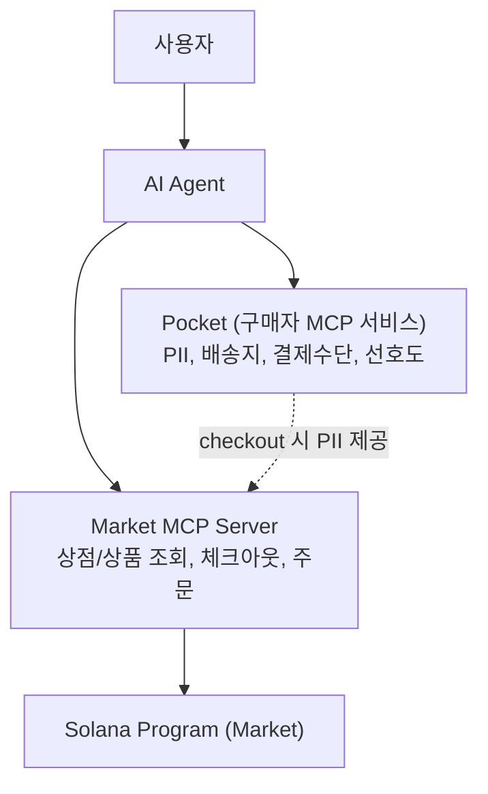
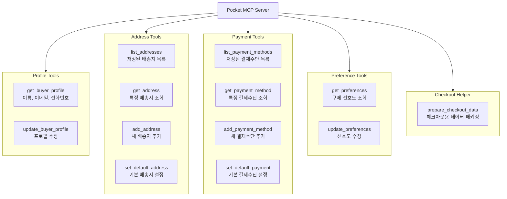
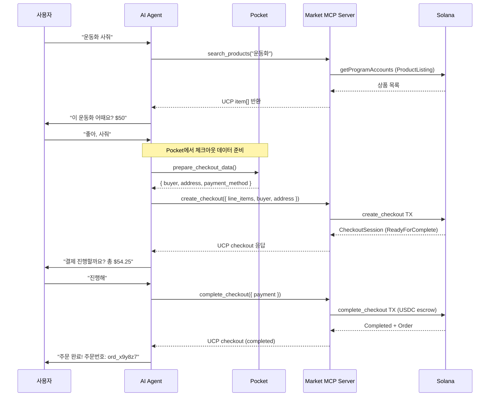
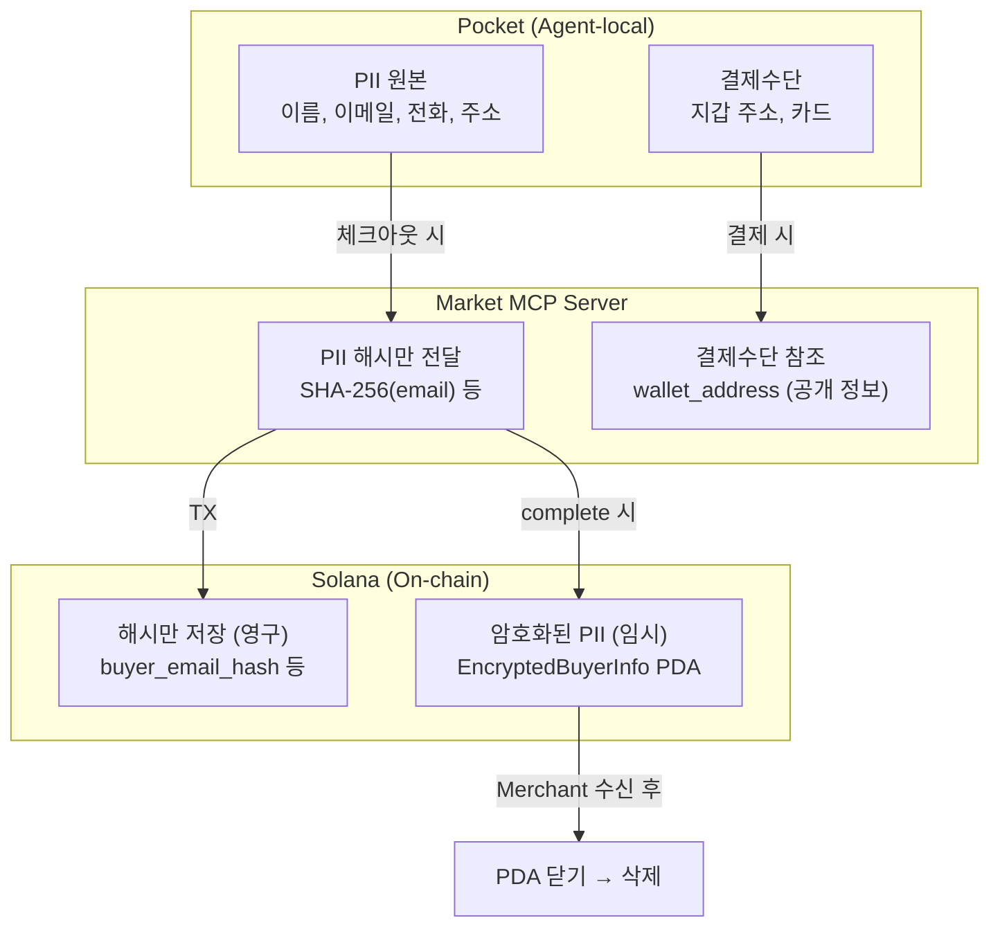
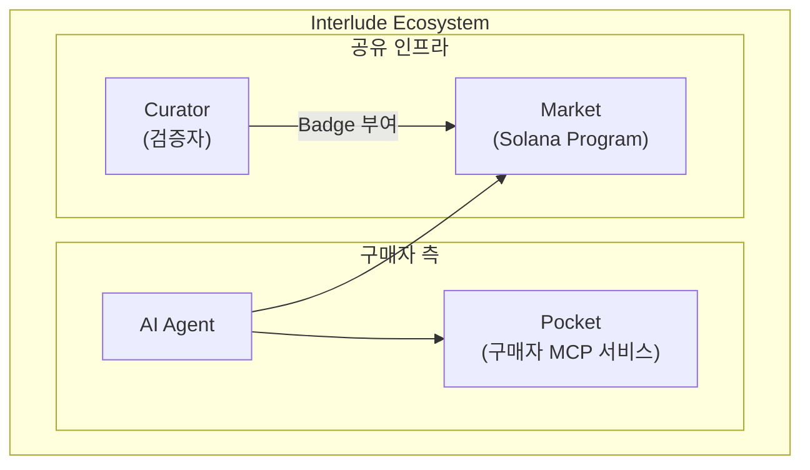

# Pocket — 구매자 MCP 서비스 설계

> [07-implementation-plan.md](07-implementation-plan.md) ← 이전

---

## 독해 가이드

- 이 문서의 목표:
Pocket의 역할, 데이터 모델, Market MCP Server와의 분리 경계를 고정한다.
- 지금 몰라도 되는 것:
구체적인 암호화 알고리즘, 동기화 프로토콜 세부
- 여기서 꼭 잡을 것:
Pocket은 **구매자의 Agent-local 서비스**이며, Market(커머스 온체인)과 독립적으로 동작한다

---

## Pocket이란?

**Pocket**은 구매자 측에서 실행되는 Agent-local MCP 서비스다.

개인정보, 배송지, 결제 수단, 구매 선호도를 안전하게 보관하고,
AI Agent가 쇼핑 시 필요한 정보를 자동으로 제공한다.



### Pocket vs Market MCP Server

| 구분 | Pocket | Market MCP Server |
|------|--------|-------------------|
| **소유자** | 구매자 (Buyer) | 에코시스템 (누구나 실행) |
| **실행 위치** | Buyer Agent-local | Agent-local |
| **데이터** | PII, 배송지, 결제수단, 선호도 | 상점/상품/주문 (on-chain) |
| **블록체인 접근** | 없음 (순수 로컬) | Solana RPC |
| **역할** | 정보 보관 + 자동 제공 | 커머스 오케스트레이션 |
| **프라이버시** | PII 원본 보관, 외부 노출 최소화 | PII 해시만 on-chain |

---

## 핵심 원칙

1. **PII 원본은 Pocket에만 존재**: Market에는 해시만 전달
2. **Agent-local 전용**: 중앙 서버 없음, 클라우드 동기화 선택적
3. **MCP 표준 인터페이스**: AI Agent가 MCP tools/call로 접근
4. **Market과 독립적**: Pocket 없이도 Market은 동작 (수동 입력)
5. **사용자 동의 기반**: 민감 정보 접근 시 사용자 확인 요청

---

## MCP 도구 목록



---

## 데이터 모델

### Buyer Profile

```typescript
interface BuyerProfile {
  id: string;                    // 로컬 고유 ID
  first_name: string;
  last_name: string;
  email: string;
  phone_number?: string;
  preferred_language: string;    // ISO 639-1 (예: "ko")
  preferred_country: string;     // ISO 3166-1 alpha-2 (예: "KR")
  created_at: string;            // ISO 8601
  updated_at: string;
}
```

### Shipping Address

```typescript
interface ShippingAddress {
  id: string;                    // 로컬 고유 ID
  label: string;                 // "집", "회사" 등
  is_default: boolean;

  // UCP postal_address 호환
  street_address: string;
  address_locality: string;      // 시/구
  address_region: string;        // 도/주
  postal_code: string;
  address_country: string;       // ISO 3166-1 alpha-2

  recipient_name?: string;       // 수령인 (프로필과 다를 수 있음)
  recipient_phone?: string;
  delivery_instructions?: string; // 배송 메모
}
```

### Payment Method

```typescript
interface PaymentMethod {
  id: string;                    // 로컬 고유 ID
  type: "solana_wallet" | "card" | "other";
  is_default: boolean;
  label: string;                 // "USDC 지갑", "메인 카드" 등

  // Solana 지갑인 경우
  wallet_address?: string;       // 공개키
  preferred_mint?: string;       // USDC mint 등

  // 표시용
  display: {
    brand: string;               // "solana", "visa" 등
    last_digits: string;         // "...x7F2"
  };
}
```

### Buyer Preferences

```typescript
interface BuyerPreferences {
  // 쇼핑 선호
  preferred_shipping_speed: "standard" | "express" | "economy";
  auto_apply_cheapest_shipping: boolean;
  max_auto_purchase_amount: number;  // 자동 구매 한도 (USD cents)

  // 알림 선호
  notify_price_drops: boolean;
  notify_restock: boolean;

  // 프라이버시 선호
  share_email_with_merchant: boolean;
  share_phone_with_merchant: boolean;
}
```

---

## 저장소 설계

```
~/.interlude/pocket/
├── profile.enc           ← 암호화된 프로필 데이터
├── addresses.enc         ← 암호화된 배송지 목록
├── payments.enc          ← 암호화된 결제수단 목록
├── preferences.json      ← 선호도 (민감하지 않음)
└── pocket.key            ← 로컬 암호화 키 (OS keychain 연동)
```

- **암호화**: AES-256-GCM, 키는 OS keychain(macOS Keychain, Windows DPAPI)에 보관
- **백업**: 사용자 선택 시 암호화된 상태로 클라우드 동기화 가능
- **삭제**: 로컬 파일 삭제 = 완전 삭제 (중앙 서버 없음)

---

## 체크아웃 연동 흐름

AI Agent가 쇼핑을 수행할 때 Pocket과 Market MCP Server를 조합하는 흐름:



### prepare_checkout_data 상세

```typescript
// Pocket이 체크아웃에 필요한 데이터를 한 번에 패키징
// AI Agent는 이 데이터를 Market의 create_checkout에 전달

interface CheckoutData {
  buyer: {
    email: string;
    first_name: string;
    last_name: string;
    phone_number?: string;
  };

  shipping_address: {
    street_address: string;
    address_locality: string;
    address_region: string;
    postal_code: string;
    address_country: string;
  };

  payment: {
    handler_id: string;          // "usdc_escrow"
    instrument: {
      type: "solana_wallet";
      wallet_address: string;
    };
  };

  context: {
    country: string;             // 구매자 국가
    language: string;            // 구매자 언어
  };
}
```

---

## 프라이버시 모델



### 데이터 흐름 규칙

1. **Pocket → Market**: `prepare_checkout_data` 호출 시에만 PII 전달
2. **Market → Solana**: PII 원본은 전달하지 않음, 해시만 on-chain
3. **예외**: `complete_checkout` 시 ephemeral key로 암호화한 PII를 EncryptedBuyerInfo PDA에 임시 저장
4. **삭제**: Merchant 수신 확인 후 PDA 닫기 → on-chain 암호문 제거

---

## 프로젝트 구조

```
interlude-pocket/
├── src/
│   ├── index.ts               ← MCP Server 진입점
│   ├── server.ts              ← MCP Server 설정 및 도구 등록
│   │
│   ├── tools/                 ← MCP Tools
│   │   ├── profile.ts         ← get/update_buyer_profile
│   │   ├── address.ts         ← list/get/add_address, set_default
│   │   ├── payment.ts         ← list/get/add_payment_method, set_default
│   │   ├── preferences.ts     ← get/update_preferences
│   │   └── checkout.ts        ← prepare_checkout_data
│   │
│   ├── storage/               ← 로컬 암호화 저장소
│   │   ├── encrypted-store.ts ← AES-256-GCM 암/복호화
│   │   ├── keychain.ts        ← OS keychain 연동
│   │   └── migration.ts       ← 스키마 마이그레이션
│   │
│   └── types/                 ← 타입 정의
│       ├── profile.ts
│       ├── address.ts
│       ├── payment.ts
│       └── preferences.ts
│
├── package.json
├── tsconfig.json
└── README.md
```

---

## Interlude 에코시스템에서의 위치



| 구성 요소 | 역할 | 실행 위치 |
|-----------|------|-----------|
| **Pocket** | 구매자 정보 보관 + 자동 제공 | Buyer Agent-local |
| **Market** | 온체인 커머스 (등록/조회/거래) | Solana blockchain |
| **Curator** | 판매자 검증 + Badge 부여 | 독립 운영 |
| **Badge** | Curator가 부여하는 인증 증표 | On-chain (MerchantProfile) |

---

## 구현 우선순위

Pocket은 Market의 Phase 1 (Registry Core)이 안정화된 후 구현을 시작한다.

| 단계 | 내용 |
|------|------|
| **Step 1** | BuyerProfile + ShippingAddress CRUD |
| **Step 2** | PaymentMethod 관리 + prepare_checkout_data |
| **Step 3** | 암호화 저장소 + OS keychain 연동 |
| **Step 4** | Market MCP Server 연동 E2E 테스트 |
| **Step 5** | 선호도 기반 자동 선택 (배송 옵션, 결제수단) |
