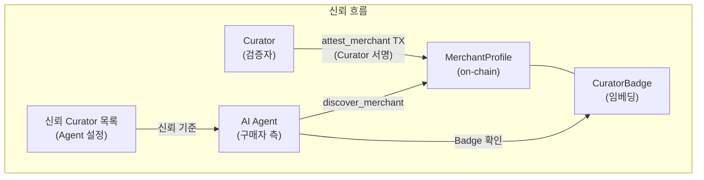
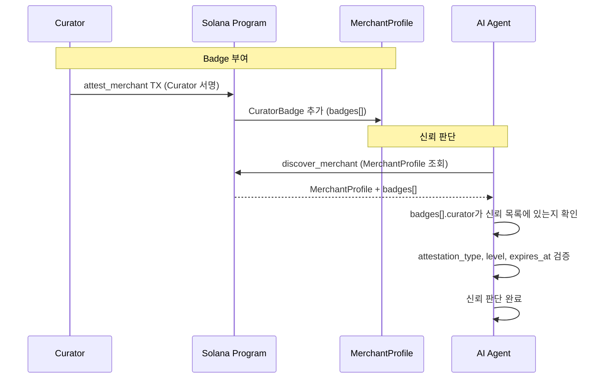
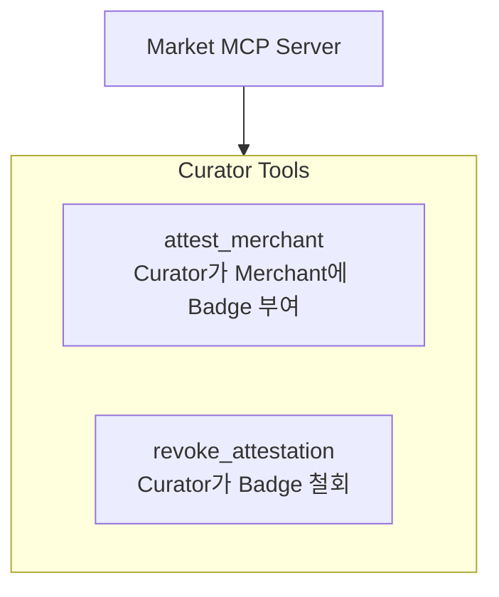

# Curator — 판매자 검증 및 Badge 부여

## Curator란?

**Curator**는 Interlude 에코시스템에서 판매자(Merchant)를 검증하고 **Badge**를 부여하는 독립 주체다.

웹에서 인증서(SSL/TLS)가 작동하는 방식과 동일한 신뢰 모델을 따른다.

| 웹 인증서 모델 | Interlude 대응 |
|----------------|----------------|
| **CA (Certificate Authority)** | **Curator** — 판매자를 검증하는 주체 |
| **SSL 인증서** | **Badge (CuratorBadge)** — Curator가 발급한 인증 증표 |
| **브라우저** | **AI Agent** — 신뢰하는 Curator 목록을 기반으로 판매자 신뢰 판단 |
| **인증서 폐기 (CRL)** | **revoke_attestation** — Badge 철회 |
| **인증서 만료** | **expires_at** — Badge 유효 기간 |

Curator는 웹의 CA처럼 누구나 될 수 있으며, AI Agent가 어떤 Curator를 신뢰할지 선택한다. Merchant가 Badge를 위조하는 것은 불가능하다 -- Badge 부여에는 반드시 Curator의 서명이 필요하기 때문이다.

---

## Badge 모델

Badge는 Curator가 Merchant에게 부여하는 on-chain 인증 증표다. `MerchantProfile` 계정에 직접 임베딩되며, 최대 5개까지 보유할 수 있다.

### CuratorBadge 구조체

```rust
#[derive(AnchorSerialize, AnchorDeserialize, Clone)]
pub struct CuratorBadge {
    pub curator: Pubkey,          // Curator 공개키 (= Certificate Authority)
    pub attestation_type: u8,     // 인증 유형 (아래 참조)
    pub level: u8,                // 인증 등급 (1=기본, 2=표준, 3=프리미엄)
    pub attested_at: i64,         // 발급 시점
    pub expires_at: i64,          // 만료 시점 (갱신 필요)
    pub metadata_hash: [u8; 32],  // 인증 근거 문서 해시 (Arweave)
}
// CuratorBadge 크기: ~82 bytes, 최대 5개 = ~410 bytes
```

### attestation_type 목록

| 코드 | 이름 | 설명 |
|------|------|------|
| `0x01` | `domain_verified` | 도메인 소유 확인 (DNS TXT 레코드 등) |
| `0x02` | `identity_verified` | 신원 확인 (KYC) |
| `0x03` | `commerce_verified` | 실제 거래 이력 확인 (외부 플랫폼) |
| `0x04` | `community_endorsed` | 커뮤니티/DAO 보증 |
| `0x05` | `financial_verified` | 재무 건전성 확인 |

### MerchantProfile 내 위치

```rust
pub struct MerchantProfile {
    // ... 기타 필드 ...

    // === Curator Badge ===
    // Curator가 직접 TX에 서명하여 Badge 부여
    // Merchant가 위조 불가 (Curator Signer 검증)
    pub badges: Vec<CuratorBadge>,  // 최대 5개
}
```

---

## 신뢰 구조





AI Agent는 다음을 기준으로 판매자 신뢰를 판단한다:

1. Badge의 `curator`가 자신의 신뢰 Curator 목록에 포함되는지
2. Badge의 `attestation_type`이 요구 수준을 충족하는지
3. Badge가 만료되지 않았는지 (`expires_at` > 현재 시각)
4. Badge의 `level`이 충분한지

---

## MCP Tools

Market MCP Server의 Curator Tools 섹션에 정의된 도구:

### attest_merchant

Curator가 Merchant에 Badge를 부여한다.



- **호출자**: Curator (서명 필수)
- **입력**: merchant 주소, attestation_type, level, expires_at, metadata_hash
- **결과**: MerchantProfile.badges[]에 CuratorBadge 추가
- **제한**: 최대 5개 Badge, 초과 시 `MaxAttestationsExceeded` 에러

### revoke_attestation

Curator가 이전에 부여한 Badge를 철회한다.

- **호출자**: Badge를 부여한 Curator만 가능 (서명 필수)
- **입력**: merchant 주소, attestation_type
- **결과**: 해당 CuratorBadge를 badges[]에서 제거
- **존재하지 않는 경우**: `AttestationNotFound` 에러

---

## On-chain Instructions

### attest_merchant

```
Accounts:
  - curator (signer)           : Curator 지갑
  - merchant_profile (mut)     : 대상 MerchantProfile PDA
  - system_program             : System Program

Args:
  - attestation_type: u8       : 인증 유형 (0x01~0x05)
  - level: u8                  : 인증 등급 (1~3)
  - expires_at: i64            : 만료 시점 (Unix timestamp)
  - metadata_hash: [u8; 32]    : 인증 근거 문서 해시

검증:
  - curator가 서명했는지 확인
  - badges.len() < 5 (최대 5개)
  - 동일 curator + attestation_type 조합 중복 불가 (기존 것 갱신)

처리:
  - CuratorBadge 생성 -> badges[]에 push
  - MerchantAttested 이벤트 emit
```

### revoke_attestation

```
Accounts:
  - curator (signer)           : 원래 Badge를 부여한 Curator
  - merchant_profile (mut)     : 대상 MerchantProfile PDA

Args:
  - attestation_type: u8       : 철회할 인증 유형

검증:
  - curator가 서명했는지 확인
  - badges[]에서 (curator, attestation_type) 매칭 항목 존재

처리:
  - 해당 CuratorBadge를 badges[]에서 제거
  - AttestationRevoked 이벤트 emit
```

---

## On-chain Events

### MerchantAttested

Badge가 부여될 때 발생한다.

```rust
#[event]
pub struct MerchantAttested {
    pub merchant: Pubkey,
    pub curator: Pubkey,
    pub attestation_type: u8,
    pub level: u8,
    pub expires_at: i64,
    pub timestamp: i64,
}
```

### AttestationRevoked

Badge가 철회될 때 발생한다.

```rust
#[event]
pub struct AttestationRevoked {
    pub merchant: Pubkey,
    pub curator: Pubkey,
    pub attestation_type: u8,
    pub timestamp: i64,
}
```

이 이벤트들은 WebSocket 구독이나 트랜잭션 로그를 통해 실시간 감지할 수 있다. AI Agent나 모니터링 시스템이 Badge 변동을 추적하는 데 활용된다.

---

## Curator 생태계

### 다중 Curator 경쟁 구조

Interlude는 단일 Curator에 의존하지 않는다. 웹에서 다수의 CA(Let's Encrypt, DigiCert, Comodo 등)가 경쟁하듯, 복수의 Curator가 독립적으로 운영되며 Merchant는 원하는 Curator를 선택한다.

```
Curator 생태계:
├── 복수 Curator 독립 운영
├── Merchant가 Curator를 자유롭게 선택
├── AI Agent가 신뢰 Curator 목록을 자체 관리
├── Curator 간 경쟁 -> 검증 품질 향상
└── 특정 Curator 장애/편향 시 대체 가능
```

### Curator 중앙화 방지

특정 Curator에 과도한 의존이 발생하면 탈중앙화 취지가 훼손된다. 이를 방지하기 위해:

- MCP 기본 검색 전략을 `multi-index quorum`으로 설정 가능
- Curator별 점유율, 실패율, 지연 시간을 월간 점검
- 공식 Curator 장애/편향 공지 템플릿 준비
- 대체 Curator 목록 자동 갱신

### Curator 신뢰 점수

Curator 자체의 신뢰도를 평가하는 메커니즘:

- 해당 Curator가 Badge를 부여한 Merchant의 분쟁/환불 비율 추적
- 이상 탐지 시 커뮤니티 경고 발행
- AI Agent가 신뢰 Curator 목록에서 제외할 수 있음
- on-chain AttestationRevoked 이벤트로 Badge 철회 패턴 투명하게 추적

---

## PII Relay (선택적 보조 계층)

> **명칭 구분**: "Curator"는 Merchant를 검증하고 Badge를 부여하는 **Trust Curator**를 의미한다. PII 캐시 서비스는 역할이 다르므로 **PII Relay**로 구분한다. 동일 운영자가 두 역할을 겸할 수 있지만, 프로토콜상 독립적인 서비스이다.

Curator의 주요 역할은 Merchant 검증 및 Badge 부여이지만, **PII Relay**라는 선택적 보조 서비스도 존재한다.

Merchant가 직접 on-chain EncryptedBuyerInfo PDA를 읽고 복호화할 수 있지만, 운영 편의를 위해 PII Relay를 활용할 수 있다.

```
PII Relay 역할:
├── on-chain EncryptedBuyerInfo 이벤트 감지
├── Merchant 위임 키로 복호화 -> 운영 DB에 캐시
├── Merchant에게 조회 API 제공 (배송지, 고객 목록, 검색)
├── GDPR 삭제 요청 시 캐시에서 삭제
└── Webhook 브릿지 역할 병행 가능
```

핵심 특성:

- **선택적**: Merchant가 PII Relay 없이도 직접 PDA 조회/복호화 가능
- **대체 가능**: 복수 PII Relay 운영 가능, Merchant가 자유롭게 선택/변경
- **장애 내성**: PII Relay 장애 시 Merchant가 Solana PDA 직접 조회로 fallback
- **프로토콜 중립**: 특정 PII Relay에 종속되지 않음

PII 전달의 전체 흐름(ephemeral key + PDA closure 패턴)은 [market/](../market/) 문서를 참조한다.

---

## 관련 리스크

Curator 운영과 관련된 주요 리스크 요약. 전체 리스크 레지스터는 [operations/risks.md](../operations/risks.md)를 참조한다.

| ID | 리스크 | 심각도 | 대응 전략 |
|----|--------|--------|-----------|
| **R-02** | 시빌 공격으로 평판 왜곡 | High | portable reputation + 신뢰 그래프 + 가중치, Curator Badge 기반 판매자 신뢰 검증 |
| **R-03** | 검색 Curator 중앙화 | High | 다중 Curator, 클라이언트 선택 라우팅, Curator 간 경쟁적 Badge 생태계 (CA 모델) |
| **R-15** | Curator Badge 남용 (허위 Badge 발급) | Medium | Curator 신뢰 점수 도입, AI Agent의 Curator 선택권 보장, Badge 이벤트 on-chain 투명성 |
