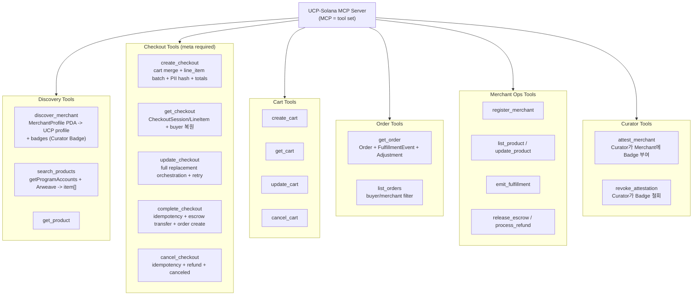

# MCP Server 설계

Market의 MCP Server는 AI Agent 측에서 실행되는 도구 인터페이스로, UCP 오퍼레이션을 Solana 트랜잭션으로 변환한다. 중앙 서버가 아니라 Agent-local로 동작하며, discovery/read path 안정화가 1차 역할이다.

---

## 역할 우선순위 (Registry-first)

1. `discover_merchant`, `search_products`, `get_product`를 가장 먼저 안정화
2. 등록/조회 데이터의 UCP 호환성 보장 (schema/version 고정)
3. checkout/order/payment는 모듈로 점진 연결

---

## 프로젝트 구조

```
ucp-solana-mcp/
├── src/
│   ├── index.ts                ← MCP Server 진입점
│   ├── server.ts               ← MCP Server 설정 및 도구 등록
│   │
│   ├── tools/                  ← MCP Tools (UCP 오퍼레이션)
│   │   ├── merchant.ts         ← discover_merchant, register_merchant
│   │   ├── product.ts          ← search_products, get_product
│   │   ├── attestation.ts     ← attest_merchant, revoke_attestation (Curator용)
│   │   ├── checkout.ts         ← create/get/update/complete/cancel_checkout
│   │   ├── cart.ts             ← create/get/update/cancel_cart
│   │   └── order.ts            ← get_order, list_orders
│   │
│   ├── solana/                 ← Solana 상호작용 계층
│   │   ├── client.ts           ← Anchor Program 클라이언트
│   │   ├── pda.ts              ← PDA 주소 계산 유틸리티
│   │   ├── transactions.ts     ← 트랜잭션 빌더
│   │   └── accounts.ts         ← Account 데이터 역직렬화
│   │
│   ├── mappers/                ← Solana 데이터 ↔ UCP 형식 변환
│   │   ├── checkout.ts         ← CheckoutSession → UCP Checkout JSON
│   │   ├── product.ts          ← ProductListing → UCP Item JSON
│   │   ├── order.ts            ← Order → UCP Order JSON
│   │   ├── messages.ts         ← error_flags → UCP messages[]
│   │   └── payment.ts          ← sol.usdc instrument ↔ Solana 결제
│   │
│   ├── arweave/                ← Arweave 클라이언트
│   │   ├── client.ts           ← 업로드/조회
│   │   └── metadata.ts         ← 메타데이터 스키마
│   │
│   ├── offchain/               ← Off-chain 데이터 관리
│   │   ├── db.ts               ← Redis/SQLite 클라이언트
│   │   ├── buyer-info.ts       ← Buyer PII 저장/조회 (해시 검증)
│   │   ├── idempotency.ts      ← 멱등성 키 관리
│   │   └── session.ts          ← continue_url, 세션 데이터
│   │
│   ├── crypto/                 ← PII 암호화 모듈
│   │   ├── ephemeral-key.ts    ← 주문별 임시 키 생성/관리
│   │   ├── encrypt-pii.ts      ← PII 암호화 (ephemeral pubkey)
│   │   └── wrap-key.ts         ← ephemeral privkey를 Merchant pubkey로 래핑
│   │
│   └── types/                  ← 타입 정의
│       ├── ucp.ts              ← UCP 스키마 타입
│       └── solana.ts           ← Solana Account 타입 (Anchor IDL)
│
├── package.json
├── tsconfig.json
└── README.md
```

## MCP 도구 목록 (UCP 오퍼레이션 매핑)



## 핵심 도구 상세: create_checkout

MCP 요청 -> Solana 트랜잭션 -> UCP 응답 변환의 전체 흐름:

```
[1] AI 에이전트가 MCP tools/call 호출
{
  "jsonrpc": "2.0",
  "id": 1,
  "method": "tools/call",
  "params": {
    "name": "create_checkout",
    "arguments": {
      "meta": {
        "ucp-agent": { "profile": "https://agent.example/profile" }
      },
      "checkout": {
        "line_items": [
          { "item": { "id": "shoe-001" }, "quantity": 2 }
        ],
        "buyer": {
          "email": "buyer@example.com",
          "first_name": "Jane",
          "last_name": "Doe"
        },
        "context": {
          "country": "US"
        }
      }
    }
  }
}

[2] MCP Server 내부 처리
    a. cart_id 있으면: off-chain DB에서 Cart 데이터 로드 → line_items 사용
    b. merchant address로 MerchantProfile PDA 계산
    c. "shoe-001"로 ProductListing PDA 계산 → 가격/재고 확인
    d. checkout_id 생성 (랜덤 16 bytes)
    e. Off-chain DB에 Buyer PII 원본 저장 (checkout_id → { email, name, phone })
    f. ⚡ Instruction 배칭:
       TX 1: create_checkout + add_checkout_line_item × min(N, 3)
       → 상품 1-3개: 단일 TX (원자적, ~1100 bytes)
       → 상품 4-10개: TX 1(create+3개) + TX 2(나머지) 순차 실행
    g. 트랜잭션 확인 대기 (commitment: confirmed)
    h. ⚠ TX 2 실패 시: 최대 3회 재시도 → 여전히 실패 시
       → 부분 생성된 checkout 반환 (status: incomplete)
       → messages에 "일부 상품 추가 실패" 경고 포함
       → AI가 update_checkout으로 재시도 가능

[3] CheckoutSession 계정 상태 읽기
    a. 계정 데이터 역직렬화
    b. CheckoutLineItem[] PDA 조회 (line_item_count만큼)
    c. error_flags 분석 → UCP messages 배열 생성
    d. 상태 판단 → UCP status 매핑
    e. Off-chain DB에서 buyer 원본 복원

[4] UCP MCP 형식으로 응답 구성
{
  "jsonrpc": "2.0",
  "id": 1,
  "result": {
    "structuredContent": {
      "checkout": {
        "ucp": {
          "version": "2026-01-11",
          "capabilities": {
            "dev.ucp.shopping.checkout": [{ "version": "2026-01-11" }]
          },
          "payment_handlers": {
            "sol.usdc": [{
              "id": "usdc_escrow",
              "version": "2026-01-11",
              "config": {
                "network": "mainnet-beta",
                "program_id": "UCPxxxxxxxxxxxxxxxxxxxxxxxxxxxxxxxxxxxxxxxxx",
                "usdc_mint": "EPjFWdd5AufqSSqeM2qN1xzybapC8G4wEGGkZwyTDt1v",
                "escrow_type": "program_controlled",
                "auto_release_days": 14
              }
            }]
          }
        },
        "id": "chk_a1b2c3d4e5f6...",
        "status": "incomplete",
        "currency": "USD",
        "line_items": [
          {
            "id": "li_0",
            "item": {
              "id": "shoe-001",
              "title": "Classic Sneakers",
              "price": 5000,
              "image_url": "https://arweave.net/abc123..."
            },
            "quantity": 2,
            "totals": [
              { "type": "subtotal", "amount": 10000 },
              { "type": "total", "amount": 10000 }
            ]
          }
        ],
        "totals": [
          { "type": "subtotal", "amount": 10000 },
          { "type": "total", "amount": 10000 }
        ],
        "messages": [
          {
            "type": "error",
            "code": "missing",
            "path": "$.fulfillment",
            "severity": "recoverable",
            "content": "Shipping address is required"
          }
        ],
        "links": [
          { "type": "terms_of_service", "url": "https://..." },
          { "type": "privacy_policy", "url": "https://..." },
          { "type": "refund_policy", "url": "https://..." }
        ],
        "expires_at": "2026-02-12T20:00:00Z"
      }
    },
    "content": [
      { "type": "text", "text": "{\"checkout\":{...}}" }
    ]
  }
}
```

## 핵심 도구 상세: complete_checkout (결제 흐름)

```
[1] AI 에이전트가 complete_checkout 호출
{
  "jsonrpc": "2.0",
  "id": 3,
  "method": "tools/call",
  "params": {
    "name": "complete_checkout",
    "arguments": {
      "meta": {
        "ucp-agent": { "profile": "https://agent.example/profile" },
        "idempotency-key": "550e8400-e29b-41d4-a716-446655440000"
      },
      "id": "chk_a1b2c3d4e5f6...",
      "checkout": {
        "payment": {
          "instruments": [{
            "id": "instr_usdc_1",
            "handler_id": "usdc_escrow",
            "type": "crypto_wallet",
            "selected": true,
            "credential": {
              "type": "solana_wallet",
              "wallet_address": "BuyerWallet111...xxx"
            }
          }]
        }
      }
    }
  }
}

[2] MCP Server 내부 처리
    a. 멱등성 검사:
       → IdempotencyRecord PDA 조회
       → 존재하면: 이전 결과 즉시 반환 (재실행 안함)
       → 없으면: 진행
    b. CheckoutSession PDA 조회 → status == ReadyForComplete 확인
    c. payment.instruments[0] 파싱:
       → handler_id = "usdc_escrow" → sol.usdc 결제 모드
       → credential.wallet_address → Buyer 지갑 주소
    d. Buyer의 USDC Token Account 확인 → 잔액 >= total
    e. ⚡ PII 암호화 (Agent 로컬):
       → ephemeral_keypair = Keypair.generate()
       → Off-chain DB에서 buyer PII 로드 (email, name, phone, address)
       → encrypted_pii = encrypt(pii_json, ephemeral_keypair.publicKey)
       → MerchantProfile PDA에서 merchant.authority (pubkey) 조회
       → encrypted_ephemeral_key = encrypt(ephemeral_keypair.secretKey, merchant.authority)

    f. Solana 트랜잭션 빌드:

       ┌─ Instruction 1: Create IdempotencyRecord PDA
       │   key = SHA-256(idempotency_key_uuid)[:16]
       │
       ├─ Instruction 2: SPL Token Transfer
       │   from: Buyer USDC Account
       │   to:   Escrow Vault (PDA Token Account)
       │   amount: total
       │   authority: Buyer (서명 필요)
       │
       ├─ Instruction 3: complete_checkout
       │   CheckoutSession.status = Completed
       │   CheckoutSession.is_funded = true
       │   CheckoutSession.complete_idempotency_key = key
       │
       ├─ Instruction 4: create_order
       │   Order PDA 생성 (checkout 데이터 복사)
       │   Order.escrow_release_after = now + 14일
       │   재고 차감 (ProductListing.stock -= quantity)
       │   판매 카운트 증가 (ProductListing.total_sold += quantity)
       │
       └─ Instruction 5: create_encrypted_buyer_info
           EncryptedBuyerInfo PDA 생성
           { encrypted_pii, encrypted_ephemeral_key, ephemeral_pubkey }
           → Merchant가 자기 privkey로 복호화 가능

    g. 트랜잭션 전송 (Buyer 서명 필요)
    h. ephemeral_keypair 메모리에서 즉시 삭제 (Agent 측에 잔존하지 않음)
    i. 확인 후 UCP 응답 반환

[3] 응답
{
  "jsonrpc": "2.0",
  "id": 3,
  "result": {
    "structuredContent": {
      "checkout": {
        "ucp": { "version": "2026-01-11", ... },
        "id": "chk_a1b2c3d4e5f6...",
        "status": "completed",
        "currency": "USD",
        "line_items": [...],
        "totals": [
          { "type": "subtotal", "amount": 10000 },
          { "type": "fulfillment", "amount": 500, "display_text": "Standard Shipping" },
          { "type": "tax", "amount": 900 },
          { "type": "total", "amount": 11400 }
        ],
        "order": {
          "id": "ord_x9y8z7...",
          "permalink_url": "https://explorer.solana.com/tx/..."
        },
        "links": [...]
      }
    },
    "content": [
      { "type": "text", "text": "{\"checkout\":{...}}" }
    ]
  }
}
```

서명 모델 상세는 [payment.md](payment.md#서명-모델-옵션) 참조.

## 핵심 도구 상세: get_order (주문 조회)

```
[1] AI 에이전트가 get_order 호출
{
  "method": "tools/call",
  "params": {
    "name": "get_order",
    "arguments": {
      "meta": { "ucp-agent": { "profile": "..." } },
      "id": "ord_x9y8z7..."
    }
  }
}

[2] MCP Server 내부 처리
    a. Order PDA 조회 → 기본 주문 데이터
    b. CheckoutLineItem[] PDA 조회 → line_items (불변)
    c. FulfillmentExpectation[] PDA 조회 → fulfillment.expectations[]
    d. FulfillmentEvent[] PDA 조회 → fulfillment.events[]
    e. Adjustment[] PDA 조회 → adjustments[]
    f. MerchantProfile PDA 조회 → 배송 방법 정보
    g. 배송 주소 복원:
       → Agent Off-chain DB에 원본이 있으면 사용 (Agent가 Buyer 측인 경우)
       → 없으면 EncryptedBuyerInfo PDA 조회 → 복호화 (Merchant 측인 경우)
       → PDA가 닫혀있으면 Curator에서 캐시 조회 (fallback)
    h. Order line_items quantity 변환:
       → CheckoutLineItem.quantity → { total: quantity }
       → FulfillmentEvent[] 집계 → { fulfilled: Σ(delivered 수량) }
       → status 결정: fulfilled==0 → "processing",
                      fulfilled<total → "partial",
                      fulfilled>=total → "fulfilled"

[3] UCP Order JSON 구성
{
  "order": {
    "ucp": { "version": "2026-01-11" },
    "id": "ord_x9y8z7...",
    "checkout_id": "chk_a1b2c3d4e5f6...",
    "permalink_url": "https://explorer.solana.com/address/OrderPDA...",
    "line_items": [
      {
        "id": "li_0",
        "item": { "id": "shoe-001", "title": "Classic Sneakers", "price": 5000 },
        "quantity": { "total": 2, "fulfilled": 0 },
        "status": "processing",
        "totals": [
          { "type": "subtotal", "amount": 10000 },
          { "type": "total", "amount": 10000 }
        ]
      }
    ],
    "totals": [
      { "type": "subtotal", "amount": 10000 },
      { "type": "fulfillment", "amount": 500 },
      { "type": "tax", "amount": 900 },
      { "type": "total", "amount": 11400 }
    ],
    "fulfillment": {
      "expectations": [
        {
          "id": "exp_001",
          "line_items": [{ "id": "li_0", "quantity": 2 }],
          "method_type": "shipping",
          "destination": {
            "street_address": "123 Main St",
            "address_locality": "San Francisco",
            "address_region": "CA",
            "postal_code": "94105",
            "address_country": "US"
          },
          "description": "Standard Shipping - 5 to 8 business days",
          "fulfillable_on": "now"
        }
      ],
      "events": [
        {
          "id": "evt_001",
          "occurred_at": "2026-02-12T15:30:00Z",
          "type": "processing",
          "line_items": [{ "id": "li_0", "quantity": 2 }],
          "description": "Order is being prepared"
        },
        {
          "id": "evt_002",
          "occurred_at": "2026-02-13T10:00:00Z",
          "type": "shipped",
          "line_items": [{ "id": "li_0", "quantity": 2 }],
          "tracking_number": "1Z999AA10123456784",
          "tracking_url": "https://ups.com/track/1Z999AA10123456784",
          "carrier": "UPS",
          "description": "Shipped via UPS Ground"
        }
      ]
    },
    "adjustments": [],
    "links": [
      { "type": "terms_of_service", "url": "https://..." }
    ]
  }
}
```

## 에러 처리

프로토콜 에러(MCP 레벨)와 비즈니스 에러(UCP 레벨)의 전체 코드 목록은 [reference/error-codes.md](../reference/error-codes.md) 참조.
