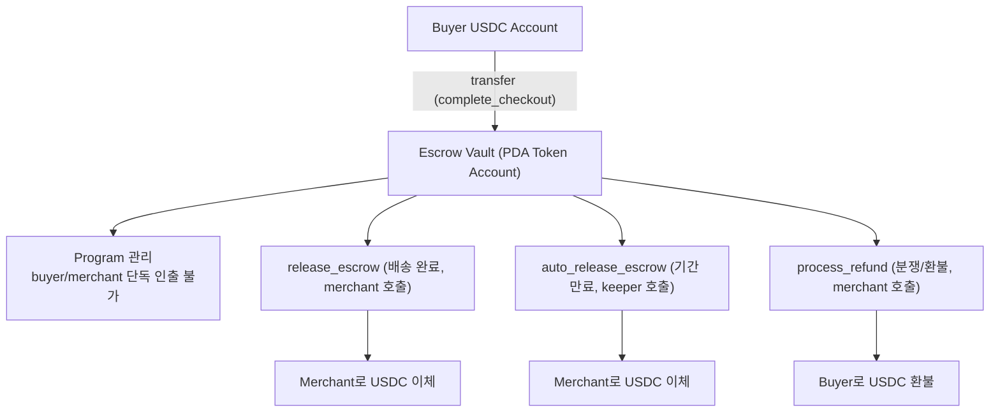
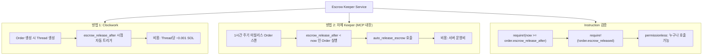

# Payment 설계

Market의 결제 계층으로, sol.usdc Payment Handler 정의, 에스크로 흐름, 크랭커(Keeper) 설계, 서명 모델을 포함한다. 결제는 registry/discovery와 분리된 선택형 모듈이다.

---

## sol.usdc Payment Handler

UCP payment handler로서 `sol.usdc`를 정의한다. 기존 `com.google.pay`, `com.stripe` 등과 동일한 레벨에서 작동한다.

> **이 문서가 sol.usdc config의 단일 기준(canonical source)이다.**
> 다른 문서의 config 예시는 이 문서의 스키마를 따른다.

### Discovery에서의 선언

```json
{
  "services": {
    "dev.ucp.shopping": [{
      "transport": "mcp",
      "version": "2026-01-11",
      "endpoint": "https://ucp-solana-mcp.example.com",
      "spec": "https://ucp-solana-mcp.example.com/openrpc.json",
      "schema": "https://ucp-solana-mcp.example.com/schema.json"
    }]
  }
}
```

### Checkout 응답의 payment_handlers

```json
{
  "payment_handlers": {
    "sol.usdc": [{
      "id": "usdc_escrow",
      "version": "2026-01-11",
      "config": {
        "network": "mainnet-beta",
        "program_id": "UCPxxxxxxxxxxxxxxxxxxxxxxxxxxxxxxxxxxxxxxxxx",
        "usdc_mint": "EPjFWdd5AufqSSqeM2qN1xzybapC8G4wEGGkZwyTDt1v",
        "escrow_type": "program_controlled",
        "auto_release_days": 14
      }
    }]
  }
}
```

### Payment Instrument 구조 (complete_checkout 시)

```json
{
  "payment": {
    "instruments": [{
      "id": "instr_usdc_1",
      "handler_id": "usdc_escrow",
      "type": "crypto_wallet",
      "selected": true,
      "credential": {
        "type": "solana_wallet",
        "wallet_address": "BuyerWallet111...xxx"
      },
      "display": {
        "brand": "solana",
        "label": "USDC Wallet",
        "last_digits": "...xxx"
      }
    }]
  }
}
```

**Tokenization 불필요**: 기존 UCP에서는 카드번호를 토큰화하지만, Solana에서는 지갑 주소가 공개 정보이므로 토큰화 과정이 필요 없다. 지갑 서명 = 결제 승인.

---

## 에스크로 흐름



### 에스크로 정책

- **결제 시**: Buyer -> Escrow Vault로 USDC 이동
- **배송 완료 확인 시**: Merchant의 `release_escrow` 호출 -> Merchant Treasury로 이동
- **자동 릴리스**: `escrow_release_after` 시점 (기본 14일) 경과 후, **크랭커가** `auto_release_escrow` 호출
- **환불**: `process_refund`로 Escrow -> Buyer 환불 (전액 또는 부분)

---

## 크랭커 (Keeper) 설계



---

## 서명 모델 옵션

complete_checkout 시 Buyer 서명이 필요하다. 세 가지 옵션을 고려한다.

### Option A: Buyer가 직접 서명

- MCP Server가 트랜잭션을 직렬화하여 AI에게 반환
- AI가 Buyer의 지갑에 서명 요청
- 서명된 트랜잭션을 MCP Server가 전송
- 가장 안전하지만 UX가 2단계

### Option B: 위임된 키로 서명 (Recommended)

- Buyer가 사전에 Session Key를 MCP Server에 위임
- MCP Server가 한도 내에서 자동 서명
- Squads 멀티시그 또는 Session Key 패턴 활용
- AI 에이전트의 자율 거래에 적합

### Option C: 서버 관리 지갑 (프로토타입용)

- MCP Server가 Buyer 전용 지갑을 관리
- 가장 간단하지만 중앙화됨 (탈중앙화 철학에 반함)
