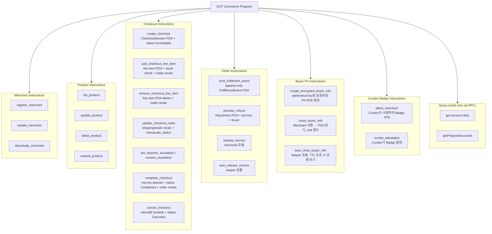
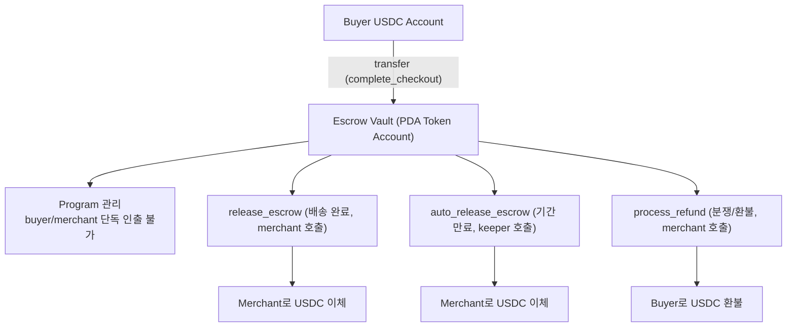
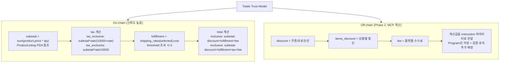

# Solana Program 설계

Market의 on-chain 계층으로, 하나의 Anchor 프로그램(`ucp_commerce`)에 모든 커머스 로직을 포함한다. 상점/상품/주문의 신뢰 데이터를 on-chain에 기록하며, permissionless listing + verifiable discovery를 핵심으로 한다.

---

## 구현 우선순위 (Registry-first)

1. MerchantProfile/ProductListing 중심의 permissionless 등록
2. UCP discovery/search를 위한 조회 일관성
3. Checkout/Order/Payment 모듈의 점진 확장

결제 로직은 중요하지만 Registry/Discovery가 안정화된 뒤 연결하는 것을 기본 전략으로 한다.

---

## 프로그램 구조

```
programs/ucp-commerce/
├── src/
│   ├── lib.rs              ← 프로그램 진입점, 모든 instruction 등록
│   ├── state/              ← Account 구조체 정의
│   │   ├── mod.rs
│   │   ├── merchant.rs     ← MerchantProfile
│   │   ├── product.rs      ← ProductListing
│   │   ├── checkout.rs     ← CheckoutSession, CheckoutLineItem
│   │   ├── order.rs        ← Order, FulfillmentEvent, Adjustment
│   │   ├── idempotency.rs  ← IdempotencyRecord
│   │   └── buyer_info.rs   ← EncryptedBuyerInfo
│   ├── instructions/       ← Instruction 핸들러
│   │   ├── mod.rs
│   │   ├── merchant.rs     ← register/update merchant
│   │   ├── product.rs      ← list/update/delist product
│   │   ├── checkout.rs     ← create/update/complete/cancel checkout
│   │   ├── order.rs        ← create order, fulfillment events, refund
│   │   ├── escrow.rs       ← release_escrow, auto_release (keeper)
│   │   └── buyer_info.rs   ← create/close encrypted buyer info
│   ├── errors.rs           ← 커스텀 에러 코드
│   └── events.rs           ← on-chain 이벤트 정의
├── Anchor.toml
└── Cargo.toml
```

## Account 구조체 (PDAs)

### MerchantProfile

```rust
// PDA seed: ["merchant", merchant_authority.key()]
#[account]
pub struct MerchantProfile {
    // === 식별 ===
    pub authority: Pubkey,         // 상점 운영자 지갑 (서명 권한)
    pub treasury: Pubkey,          // 수익금 수령 지갑 (authority와 다를 수 있음)
    pub bump: u8,                  // PDA bump seed

    // === UCP 메타데이터 ===
    pub version: String,           // "2026-01-11"
    pub name: String,              // 상점 이름 (최대 64 bytes)
    pub description: String,       // 상점 설명 (최대 256 bytes)
    pub metadata_uri: String,      // Arweave URI (로고, 상세 정보)

    // === Capabilities ===
    pub supports_checkout: bool,
    pub supports_cart: bool,
    pub supports_order: bool,
    // ⚠ fulfillment 확장(dev.ucp.shopping.fulfillment)은 선언하지 않음.
    //   UCP fulfillment 확장은 checkout에 methods→destinations→groups→options
    //   중첩 구조를 요구하므로, 대신 배송비를 merchant-internal로 처리하고
    //   totals[type:"fulfillment"]으로만 노출한다.
    //   Order 쪽의 expectations/events는 별도 PDA로 정상 지원.
    pub supports_discount: bool,

    // === 결제 설정 ===
    pub accepted_mints: Vec<Pubkey>,  // 수령 가능한 SPL 토큰 Mint 목록
    pub usdc_mint: Pubkey,            // 기본 USDC Mint

    // === 가격 정책 (하이브리드 Totals 계산) ===
    pub tax_rate_bps: u16,            // 세율 (basis points). 850 = 8.50%
    pub tax_inclusive: bool,           // true = 세금 포함가, false = 세금 별도
    pub shipping_rates: Vec<ShippingRate>, // 배송비 옵션 (최대 5개)
    pub free_shipping_threshold: u64, // 무료 배송 기준 금액 (0 = 없음)

    // === 법적 링크 (UCP links[] 필수) ===
    pub terms_of_service_url: String,
    pub privacy_policy_url: String,
    pub refund_policy_url: String,
    pub shipping_policy_url: String,

    // === 상태 ===
    pub is_active: bool,
    pub created_at: i64,
    pub updated_at: i64,
    pub product_count: u32,

    // === 거래 실적 (Program이 자동 갱신) ===
    pub total_orders: u32,            // 완료된 주문 수
    pub total_volume: u64,            // 총 거래액 (minor units)
    pub unique_buyers: u32,           // 고유 구매자 수
    pub last_order_at: i64,           // 마지막 주문 시점
    pub dispute_count: u16,           // 분쟁 발생 횟수
    pub refund_count: u16,            // 환불 횟수

    // === Curator Badge ===
    // Curator가 직접 TX에 서명하여 Badge 부여 — 웹 인증서(CA → SSL)와 동일한 신뢰 모델
    // Merchant가 위조 불가 (Curator Signer 검증)
    pub badges: Vec<CuratorBadge>,  // 최대 5개
}

#[derive(AnchorSerialize, AnchorDeserialize, Clone)]
pub struct ShippingRate {
    pub id: [u8; 16],             // 배송 옵션 ID
    pub method_type: u8,          // 1=shipping, 2=pickup, 3=digital
    pub label: String,            // "Standard Shipping" (최대 64 bytes)
    pub cost: u64,                // minor units (센트). 0 = 무료
    pub min_days: u8,             // 최소 배송일
    pub max_days: u8,             // 최대 배송일
}
// MerchantProfile 예상 크기: ~1100 bytes (ShippingRate 5개 포함)

#[derive(AnchorSerialize, AnchorDeserialize, Clone)]
pub struct CuratorBadge {
    pub curator: Pubkey,          // Curator 공개키 (= Certificate Authority)
    pub attestation_type: u8,    // 인증 유형 (아래 참조)
    pub level: u8,               // 인증 등급 (1=기본, 2=표준, 3=프리미엄)
    pub attested_at: i64,        // 발급 시점
    pub expires_at: i64,         // 만료 시점 (갱신 필요)
    pub metadata_hash: [u8; 32], // 인증 근거 문서 해시 (Arweave)
}
// attestation_type:
//   0x01: domain_verified     — 도메인 소유 확인 (DNS TXT 레코드 등)
//   0x02: identity_verified   — 신원 확인 (KYC)
//   0x03: commerce_verified   — 실제 거래 이력 확인 (외부 플랫폼)
//   0x04: community_endorsed  — 커뮤니티/DAO 보증
//   0x05: financial_verified  — 재무 건전성 확인
// CuratorBadge 크기: ~82 bytes, 최대 5개 = ~410 bytes
// MerchantProfile 예상 크기: ~1,100 + 410 + 50(거래 실적) ≈ ~1,560 bytes
```

### ProductListing

```rust
// PDA seed: ["product", merchant.key(), product_id.as_bytes()]
#[account]
pub struct ProductListing {
    // === 식별 ===
    pub merchant: Pubkey,          // 소속 상점
    pub product_id: String,        // UCP item.id에 매핑 (최대 32 bytes)
    pub bump: u8,

    // === 상품 정보 (on-chain) ===
    pub title: String,             // 상품명 (최대 128 bytes)
    pub price: u64,                // Minor units (센트). 예: 2500 = $25.00
    pub stock: u32,                // 재고 수량 (0 = 무제한은 u32::MAX)
    pub is_active: bool,           // 판매 중 여부

    // === 상품 정보 (off-chain 참조) ===
    pub metadata_uri: String,      // Arweave URI (상세 설명, 스펙)
    pub image_uri: String,         // Arweave URI (대표 이미지)

    // === 카테고리/태그 ===
    pub category: String,          // 카테고리 (최대 32 bytes)
    pub tags: Vec<String>,         // 검색 태그 (최대 5개, 각 16 bytes)

    // === 배송 방법 ===
    pub fulfillment_types: Vec<u8>, // 1=shipping, 2=pickup, 3=digital (ShippingRate/Expectation과 동일)

    // === 이력 ===
    pub created_at: i64,
    pub updated_at: i64,
    pub total_sold: u64,           // 누적 판매 수량
}
// 예상 크기: ~600 bytes
```

### CheckoutSession

```rust
// PDA seed: ["checkout", checkout_id]
#[account]
pub struct CheckoutSession {
    // === 식별 ===
    pub checkout_id: [u8; 16],     // 128-bit 랜덤 ID
    pub merchant: Pubkey,          // 판매 상점
    pub buyer: Pubkey,             // 구매자 지갑 (Pubkey::default() = 미지정)
                                   // UCP: buyer는 optional → 0값이면 미지정
    pub bump: u8,

    // === 상태 (UCP 6개 상태와 1:1 매핑) ===
    pub status: CheckoutStatus,

    // === 상품 목록 ===
    pub line_item_count: u8,       // line_items는 별도 PDA (CheckoutLineItem)
                                   // → 트랜잭션 크기 제한 해결

    // === 금액 (모두 minor units, currency는 USD) ===
    // 하이브리드 계산: subtotal은 Program이 line_items에서 자동 계산
    //                tax는 subtotal × merchant.tax_rate_bps로 Program이 계산
    //                fulfillment_cost는 merchant.shipping_rates에서 선택
    //                discount은 0 (Phase 2에서 off-chain 구현)
    //                total = tax_inclusive ? subtotal - discount + fulfillment + fee
    //                      : subtotal - discount + fulfillment + tax + fee
    pub currency_mint: Pubkey,     // 결제 토큰 Mint (USDC)
    pub subtotal: u64,             // Program 계산: Σ(unit_price × quantity)
    pub items_discount: u64,       // 0 (Phase 2)
    pub discount: u64,             // 0 (Phase 2)
    pub fulfillment_cost: u64,     // merchant.shipping_rates[selected] or 0
    pub tax: u64,                  // Program 계산: tax_inclusive ? subtotal×rate/(10000+rate) : subtotal×rate/10000
    pub fee: u64,                  // 0 (향후 플랫폼 수수료)
    pub total: u64,                // Program 계산: recalculate_totals 참조 (tax_inclusive 분기)

    // === 배송 방법 선택 ===
    pub selected_shipping_rate_id: [u8; 16], // 0 = 미선택 → MerchantProfile.shipping_rates의 id

    // === 구매자 정보 (해시만 on-chain, 원본은 off-chain DB) ===
    pub buyer_email_hash: [u8; 32],      // SHA-256(email), 0 = 미제출
    pub buyer_name_hash: [u8; 32],       // SHA-256(first_name + last_name)
    pub buyer_phone_hash: [u8; 32],      // SHA-256(phone)
    pub shipping_address_hash: [u8; 32], // SHA-256(정규화된 주소)

    // === 컨텍스트 ===
    pub buyer_country: [u8; 2],    // ISO 3166-1 alpha-2 (예: "KR", "US")
    pub buyer_language: [u8; 2],   // ISO 639-1 (예: "ko", "en"), 0 = 미지정

    // === 에스크로 ===
    pub escrow_vault: Pubkey,      // 에스크로 토큰 계정
    pub is_funded: bool,           // 에스크로에 입금 완료 여부

    // === 시간 ===
    pub created_at: i64,
    pub expires_at: i64,           // 기본 6시간

    // === 에스컬레이션 ===
    pub continue_url_hash: [u8; 32],  // SHA-256(continue_url), 0 = 없음
                                       // 원본 URL은 off-chain DB

    // === 상품 유형 캐시 ===
    pub is_digital_only: bool,     // true = 모든 line_item이 digital (method_type=3)
                                   // → shipping_address 검사 생략
                                   // add/remove_line_item 시 자동 갱신

    // === 에러/메시지 플래그 ===
    pub error_flags: u32,          // 비트 플래그 (에러 + 경고 + 정보)
                                   // bit 0-4,6: reevaluate_status 관리 (MANAGED_MASK=0x005F)
                                   // bit 5: payment_declined (complete_checkout에서 설정)
                                   // bit 7-15: 외부 관리 (out_of_stock 등)
                                   // bit 16-23: warnings
                                   // bit 24-31: info
    // === 멱등성 ===
    pub complete_idempotency_key: [u8; 16],  // 0 = 미사용
    pub cancel_idempotency_key: [u8; 16],    // 0 = 미사용
}
// 예상 크기: ~450 bytes (line_items 분리 후)

#[derive(AnchorSerialize, AnchorDeserialize, Clone, PartialEq)]
pub enum CheckoutStatus {
    Incomplete,              // 0 - 정보 부족 (messages로 안내)
    RequiresEscalation,      // 1 - API로 해결 불가 (continue_url 필수)
    ReadyForComplete,        // 2 - 결제 가능
    CompleteInProgress,      // 3 - 결제 처리 중
    Completed,               // 4 - 완료 (order 생성됨)
    Canceled,                // 5 - 취소
}
```

### CheckoutLineItem (별도 PDA)

```rust
// PDA seed: ["checkout_item", checkout_session.key(), line_item_index (u8)]
// line_item은 개별 트랜잭션으로 추가 → 1232 bytes 제한 우회
#[account]
pub struct CheckoutLineItem {
    pub checkout_session: Pubkey,  // 소속 체크아웃
    pub index: u8,                 // 순서 (0-based)
    pub bump: u8,

    // === UCP line_item 매핑 ===
    pub product: Pubkey,           // ProductListing PDA
    pub product_id: String,        // UCP item.id (최대 32 bytes)
    pub title: String,             // 스냅샷: 구매 시점의 상품명 (최대 64 bytes)
    pub unit_price: u64,           // 스냅샷: 구매 시점의 단가
    pub quantity: u32,
    pub line_total: u64,           // unit_price * quantity

    // === 배송 연결 ===
    pub fulfillment_method_id: Option<[u8; 16]>,
}
// 예상 크기: ~220 bytes
// 최대 10개까지 = 10개 별도 PDA
```

### Order

```rust
// PDA seed: ["order", order_id]
#[account]
pub struct Order {
    // === 식별 ===
    pub order_id: [u8; 16],         // 128-bit 랜덤 ID
    pub checkout_id: [u8; 16],      // 원본 체크아웃 ID (UCP 필수)
    pub checkout_session: Pubkey,   // CheckoutSession PDA 주소
    pub merchant: Pubkey,
    pub buyer: Pubkey,
    pub bump: u8,

    // === 주문 정보 (체크아웃에서 복사, 불변) ===
    pub line_item_count: u8,        // CheckoutLineItem PDAs 참조
    pub currency_mint: Pubkey,

    // === 금액 (UCP totals[] 매핑) ===
    pub subtotal: u64,
    pub items_discount: u64,
    pub discount: u64,
    pub fulfillment_cost: u64,
    pub tax: u64,
    pub fee: u64,
    pub total: u64,

    // === 배송 추적 ===
    pub fulfillment_status: FulfillmentStatus,
    pub fulfillment_event_count: u16,      // FulfillmentEvent 별도 PDA 개수
    pub fulfillment_expectation_count: u8, // FulfillmentExpectation 별도 PDA 개수

    // === 환불/조정 ===
    pub refunded_amount: u64,
    pub adjustment_count: u16,          // Adjustment 별도 PDA 개수

    // === 에스크로 ===
    pub escrow_vault: Pubkey,
    pub escrow_released: bool,
    pub escrow_release_after: i64,      // 자동 릴리스 시점 (created_at + 14일)

    // === 시간 ===
    pub created_at: i64,
    pub updated_at: i64,
}
// 예상 크기: ~400 bytes (expectation 분리 후)

#[derive(AnchorSerialize, AnchorDeserialize, Clone, PartialEq)]
pub enum FulfillmentStatus {
    Processing,      // 준비 중
    Partial,         // 일부 배송됨
    Fulfilled,       // 전체 배송 완료
    Canceled,        // 취소
}
```

### FulfillmentExpectation (별도 PDA)

```rust
// PDA seed: ["expectation", order.key(), expectation_index (u8)]
// 주문 생성 시 함께 생성, 이후 merchant가 split/merge 가능
#[account]
pub struct FulfillmentExpectation {
    pub order: Pubkey,
    pub expectation_id: [u8; 16],   // 고유 ID (UCP expectation.id)
    pub index: u8,
    pub bump: u8,

    // === UCP fulfillment.expectations[] 매핑 ===
    pub method_type: u8,            // 1=shipping, 2=pickup, 3=digital
    pub description: String,        // "Standard Shipping - 5 to 8 business days" (최대 128 bytes)
    pub fulfillable_on: i64,        // 0 = "now", 양수 = 미래 시점 timestamp

    // === 해당 상품 ===
    pub line_item_indices: Vec<u8>, // 이 expectation에 해당하는 line_item index 목록
    pub quantities: Vec<u32>,       // 각 line_item별 수량

    // === 배송지 (해시만 on-chain) ===
    pub destination_hash: [u8; 32], // SHA-256(정규화된 배송지)
                                    // 원본은 off-chain DB
                                    // ⚠ digital 상품: SHA-256(buyer_email)을 destination으로 사용
                                    //   UCP spec은 모든 expectation에 destination 필수
                                    //   → MCP mapper가 digital이면
                                    //     { email: "buyer@..." } 형태의 destination 반환
}
// 예상 크기: ~300 bytes
// 예시: 상품 A+B는 shipping, 상품 C는 digital → 2개 Expectation PDA
//   shipping: destination = 물리 주소 (postal_address)
//   digital:  destination = { email: buyer_email } (UCP destination 필수 대응)
```

### FulfillmentEvent (별도 PDA)

```rust
// PDA seed: ["fulfillment_event", order.key(), event_index (u16)]
#[account]
pub struct FulfillmentEvent {
    pub order: Pubkey,
    pub event_id: [u8; 16],        // 고유 이벤트 ID
    pub index: u16,
    pub bump: u8,

    // === UCP fulfillment.events[] 매핑 ===
    pub event_type: String,         // "processing"|"shipped"|"in_transit"|"delivered"|...
    pub occurred_at: i64,           // RFC 3339 → Unix timestamp
    pub tracking_number: String,    // 운송장 번호 (최대 64 bytes, "processing" 시 빈 문자열)
    pub tracking_url: String,       // 추적 URL (최대 128 bytes)
    pub carrier: String,            // 택배사 이름 (최대 32 bytes)
    pub description: String,        // 상태 설명 (최대 128 bytes)

    // === 해당 상품 ===
    pub line_item_indices: Vec<u8>, // 이 이벤트에 해당하는 line_item index 목록
    pub quantities: Vec<u32>,       // 각 line_item별 수량
}
// 예상 크기: ~500 bytes
// UCP event types: processing, shipped, in_transit, delivered,
//   failed_attempt, canceled, undeliverable, returned_to_sender
```

### Adjustment (별도 PDA)

```rust
// PDA seed: ["adjustment", order.key(), adjustment_index (u16)]
#[account]
pub struct Adjustment {
    pub order: Pubkey,
    pub adjustment_id: [u8; 16],
    pub index: u16,
    pub bump: u8,

    // === UCP adjustments[] 매핑 ===
    pub adjustment_type: String,    // "refund"|"return"|"credit"|"dispute"|"cancellation"
    pub status: AdjustmentStatus,
    pub amount: u64,                // minor units
    pub reason: String,             // 사유 (최대 256 bytes)
    pub occurred_at: i64,
}

#[derive(AnchorSerialize, AnchorDeserialize, Clone, PartialEq)]
pub enum AdjustmentStatus {
    Pending,
    Completed,
    Failed,
}
// 예상 크기: ~400 bytes
```

### IdempotencyRecord

```rust
// PDA seed: ["idempotency", idempotency_key_bytes]
#[account]
pub struct IdempotencyRecord {
    pub key: [u8; 16],            // UUID의 바이트 표현
    pub operation: u8,            // 0=complete_checkout, 1=cancel_checkout, 2=cancel_cart
    pub checkout_session: Pubkey, // 연결된 세션
    pub result_status: u8,        // 실행 결과 상태
    pub created_at: i64,
    pub expires_at: i64,          // TTL (생성 후 24시간)
    pub bump: u8,
}
// 예상 크기: ~120 bytes
// complete/cancel 재호출 시: PDA 존재하면 이전 결과 반환
```

### EncryptedBuyerInfo (주문별 암호화된 PII)

```rust
// PDA seed: ["buyer_info", order.key()]
// complete_checkout 시 생성, Merchant 수신 확인 후 닫기 (PDA 삭제)
#[account]
pub struct EncryptedBuyerInfo {
    pub order: Pubkey,                     // 연결된 Order PDA
    pub merchant: Pubkey,                  // PDA 닫기 권한자

    // === 암호화된 PII ===
    pub encrypted_pii: Vec<u8>,            // ephemeral pubkey로 암호화된 PII JSON
                                           // 내용: { email, first_name, last_name,
                                           //         phone, shipping_address }
    pub encrypted_ephemeral_key: Vec<u8>,  // Merchant pubkey로 암호화된 ephemeral privkey
                                           // → Merchant만 자기 privkey로 복호화 가능
    pub ephemeral_pubkey: Pubkey,          // 검증용 (암호화에 사용된 공개키)

    pub created_at: i64,
    pub bump: u8,
}
// 예상 크기: ~600 bytes (PII 내용에 따라 가변)
//
// 복호화 절차 (Merchant 측):
//   1. encrypted_ephemeral_key를 Merchant privkey로 복호화 → ephemeral_privkey
//   2. encrypted_pii를 ephemeral_privkey로 복호화 → PII JSON
//   3. 배송 정보 확보 후 close_buyer_info 호출
//
// 보안 설계:
//   - 주문별 ephemeral keypair → 키 유출 시 해당 주문 1건만 영향
//   - PDA 닫기 후 on-chain active state에서 암호문 제거
//   - ephemeral privkey는 Merchant 수신 후 폐기
//   - Merchant 장기 키 유출 시에도 이미 폐기된 ephemeral key로 과거 PII 복호화 불가
```

## Instructions (명령어)



> Curator Badge Instructions (`attest_merchant`, `revoke_attestation`)의 상세 설계는 [curator/](../curator/) 참조.

## 에스크로 흐름

에스크로 설계 상세는 [payment.md](payment.md) 참조.



## On-chain Events

```rust
// Checkout 이벤트
#[event]
pub struct CheckoutCreated {
    pub checkout_id: [u8; 16],
    pub merchant: Pubkey,
    pub buyer: Pubkey,
    pub item_count: u8,
    pub timestamp: i64,
}

#[event]
pub struct CheckoutStatusChanged {
    pub checkout_id: [u8; 16],
    pub from_status: u8,
    pub to_status: u8,
    pub timestamp: i64,
}

#[event]
pub struct CheckoutCompleted {
    pub checkout_id: [u8; 16],
    pub order_id: [u8; 16],
    pub total: u64,
    pub currency_mint: Pubkey,
    pub timestamp: i64,
}

// 주문 이벤트
#[event]
pub struct FulfillmentEventEmitted {
    pub order_id: [u8; 16],
    pub event_index: u16,
    pub event_type: String,
    pub timestamp: i64,
}

#[event]
pub struct EscrowReleased {
    pub order_id: [u8; 16],
    pub amount: u64,
    pub released_to: Pubkey,     // merchant treasury
    pub auto_released: bool,     // 크랭커에 의한 자동 릴리스 여부
    pub timestamp: i64,
}

#[event]
pub struct RefundProcessed {
    pub order_id: [u8; 16],
    pub adjustment_index: u16,
    pub amount: u64,
    pub reason: String,
    pub timestamp: i64,
}

// PII 이벤트
#[event]
pub struct BuyerInfoCreated {
    pub order_id: [u8; 16],
    pub merchant: Pubkey,
    pub ephemeral_pubkey: Pubkey,        // 암호화에 사용된 임시 공개키
    pub timestamp: i64,
}

#[event]
pub struct BuyerInfoClosed {
    pub order_id: [u8; 16],
    pub merchant: Pubkey,
    pub closed_by: Pubkey,               // merchant 또는 keeper
    pub auto_closed: bool,               // TTL 초과 자동 닫기 여부
    pub timestamp: i64,
}

// Curator Badge 이벤트
#[event]
pub struct MerchantAttested {
    pub merchant: Pubkey,
    pub curator: Pubkey,
    pub attestation_type: u8,
    pub level: u8,
    pub expires_at: i64,
    pub timestamp: i64,
}

#[event]
pub struct AttestationRevoked {
    pub merchant: Pubkey,
    pub curator: Pubkey,
    pub attestation_type: u8,
    pub timestamp: i64,
}
```

## 에러 코드

에러 코드(`CommerceError`) 전체 목록은 [reference/error-codes.md](../reference/error-codes.md) 참조.

## Totals 계산 로직 (하이브리드)



```rust
// === Totals 계산 (on-chain) ===
// create_checkout 또는 add/remove_checkout_line_item 시 자동 재계산

fn recalculate_totals(
    checkout: &mut CheckoutSession,
    line_items: &[CheckoutLineItem],
    merchant: &MerchantProfile,
) {
    // 1. subtotal = 모든 line_item의 line_total 합산
    checkout.subtotal = line_items.iter()
        .map(|li| li.line_total)
        .sum();

    // 2. tax 계산 (tax_inclusive 분기)
    if merchant.tax_inclusive {
        // 세금 포함가: 가격에서 세금 추출
        // tax = subtotal × rate / (10000 + rate)
        // 예: subtotal=10850, rate=850 → tax = 10850×850/10850 = 850
        checkout.tax = checkout.subtotal
            .checked_mul(merchant.tax_rate_bps as u64)
            .unwrap()
            .checked_div(10000u64 + merchant.tax_rate_bps as u64)
            .unwrap();
    } else {
        // 세금 별도: subtotal 위에 세금 추가
        // tax = subtotal × rate / 10000
        // 예: subtotal=10000, rate=850 → tax = 850 ($8.50)
        checkout.tax = checkout.subtotal
            .checked_mul(merchant.tax_rate_bps as u64)
            .unwrap()
            .checked_div(10000)
            .unwrap();
    }

    // 3. fulfillment = 선택된 배송 옵션의 비용
    if checkout.selected_shipping_rate_id != [0u8; 16] {
        if let Some(rate) = merchant.shipping_rates.iter()
            .find(|r| r.id == checkout.selected_shipping_rate_id)
        {
            checkout.fulfillment_cost = rate.cost;
            // 무료 배송 기준 확인
            if merchant.free_shipping_threshold > 0
                && checkout.subtotal >= merchant.free_shipping_threshold
            {
                checkout.fulfillment_cost = 0;
            }
        }
    }

    // 4. total 계산
    if merchant.tax_inclusive {
        // 세금 포함가: subtotal에 이미 tax 포함 → 별도 추가 안함
        // total = subtotal - discount + fulfillment + fee
        checkout.total = checkout.subtotal
            .saturating_sub(checkout.discount)
            .saturating_add(checkout.fulfillment_cost)
            .saturating_add(checkout.fee);
    } else {
        // 세금 별도: total = subtotal - discount + fulfillment + tax + fee
        checkout.total = checkout.subtotal
            .saturating_sub(checkout.discount)
            .saturating_add(checkout.fulfillment_cost)
            .saturating_add(checkout.tax)
            .saturating_add(checkout.fee);
    }
}
```

**상태 재평가**: totals 재계산 후, 필수 필드 충족 여부를 검사하여 status를 자동 전이:

```rust
fn reevaluate_status(checkout: &mut CheckoutSession) {
    // 이미 완료/취소된 세션은 변경 불가
    if matches!(checkout.status,
        CheckoutStatus::Completed | CheckoutStatus::Canceled
    ) { return; }

    // RequiresEscalation은 resolve_escalation으로만 해제
    if checkout.status == CheckoutStatus::RequiresEscalation { return; }

    // reevaluate_status가 관리하는 비트: 0,1,2,3,4,6 (필수 필드 검사)
    // 외부에서 관리하는 비트: 5(payment_declined), 7+(out_of_stock 등)
    // → 외부 비트를 보존하고, 관리 비트만 재계산
    const MANAGED_MASK: u32 = 0x005F;  // bit 0-4,6: 이 함수가 관리
                                        // bit 5(0x0020): payment_declined → 외부 관리
                                        // bit 7+(0x0080+): out_of_stock 등 → 외부 관리
    let external_flags = checkout.error_flags & !MANAGED_MASK;

    let mut flags: u32 = 0;

    // 필수 필드 검사
    if checkout.buyer_email_hash == [0u8; 32]     { flags |= 0x0001; } // missing email
    if checkout.buyer_name_hash == [0u8; 32]      { flags |= 0x0002; } // missing name
    if checkout.shipping_address_hash == [0u8; 32]
        && !checkout.is_digital_only               { flags |= 0x0004; } // missing address (실물 배송만)
    if checkout.line_item_count == 0               { flags |= 0x0008; } // no line items
    if checkout.buyer_phone_hash == [0u8; 32]      { flags |= 0x0010; } // missing phone
    if checkout.buyer == Pubkey::default()         { flags |= 0x0040; } // no wallet
    // 0x0020 = payment_declined → complete_checkout 실패 시 설정, external_flags로 보존
    // 0x0080 = out_of_stock → add_line_item에서 설정, external_flags로 보존

    checkout.error_flags = flags | external_flags;

    checkout.status = if checkout.error_flags == 0 {
        CheckoutStatus::ReadyForComplete
    } else {
        CheckoutStatus::Incomplete
    };
}
```
