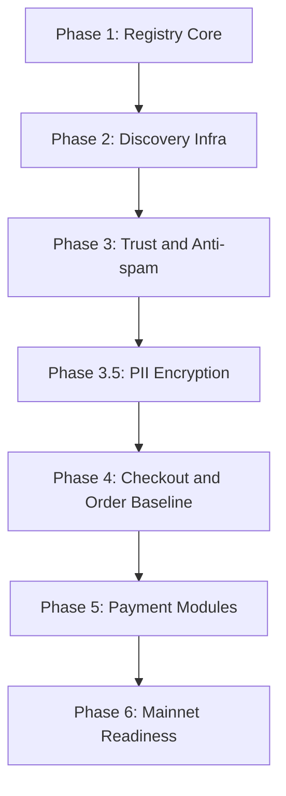

# 구현 로드맵 (Registry-first), 비용 추정, 실행 게이트

## 실행 원칙

1. 핵심 가치는 `결제`가 아니라 `permissionless listing + verifiable discovery`다.
2. 결제는 독립 모듈로 유지하고, 등록/탐색 계층과 강결합하지 않는다.
3. 확장은 단계별 게이트(KPI 통과) 방식으로만 진행한다.

---

## 구현 로드맵

```mermaid
flowchart TB
  subgraph P1["Phase 1: Registry Core (주 1-3)"]
    P1A["Anchor 프로젝트 초기화 (ucp-commerce)"]
    P1B["Account: MerchantProfile, ProductListing"]
    P1C["Instructions: register/update merchant, list/update/delist product"]
    P1D["MCP Tools: discover_merchant, search_products, get_product"]
    P1E["UCP discovery 응답을 on-chain 프로필 기반으로 생성"]
    P1F["Devnet 단위 테스트 + 등록/조회 E2E"]
  end

  subgraph P2["Phase 2: Discovery Infra (주 4-6)"]
    P2A["On-chain 이벤트 Curator 구현"]
    P2B["다중 Curator 지원 (기본 + 커뮤니티)"]
    P2C["MCP 검색 전략: on-chain direct + index fallback"]
    P2D["메타데이터 검증 (Arweave URI/해시 무결성)"]
    P2E["검색 정확도/지연 시간 KPI 계측"]
    P2F["Curator Badge 모델 구현"]
    P2G["attest_merchant / revoke_attestation instruction"]
    P2H["discover_merchant에 Badge 정보 포함"]
  end

  subgraph P3["Phase 3: Trust and Anti-spam (주 7-9)"]
    P3A["등록 스팸 방지: rate limit, staking/deposit 옵션"]
    P3T2["판매자 이력 점수 (portable reputation) 도입"]
    P3C["정책 계층 분리: 프로토콜 중립 + UI/Curator 정책"]
    P3D["신고/라벨링 이벤트 모델 정의"]
    P3E["시빌/스팸 공격 시나리오 테스트"]
    P3F["Curator 신뢰 점수 및 경쟁 생태계 설계"]
    P3G["AI Agent의 신뢰 Curator 목록 관리 프로토콜"]
  end

  subgraph P35["Phase 3.5: PII Encryption (주 10-11)"]
    P35A["EncryptedBuyerInfo PDA 구조 구현"]
    P35B["주문별 ephemeral key 생성/암호화 모듈"]
    P35C["Merchant 복호화 + close_buyer_info 흐름"]
    P35D["auto_close_buyer_info (keeper TTL 강제)"]
    P35E["PII Curator 캐시 프로토타입 (선택)"]
    P35F["PII 암호화 E2E 테스트 + 키 유출 시나리오"]
  end

  subgraph P4["Phase 4: Checkout and Order Baseline (주 12-14)"]
    P4A["CheckoutSession, CheckoutLineItem, Order 구조 안정화"]
    P4B["create/update/complete/cancel checkout 흐름 검증"]
    P4C["Full replacement 오케스트레이션 안정화"]
    P4D["주문 이벤트 추적 및 webhook bridge"]
    P4E["E2E 회복력 테스트 (부분 실패/재시도)"]
  end

  subgraph P5["Phase 5: Payment Modules (주 13-15)"]
    P5A["sol.usdc payment handler 연결"]
    P5B["Escrow vault/release/refund 모듈 연동"]
    P5C["Session key 위임 모델 적용"]
    P5D["네트워크별 설정 (devnet/mainnet)"]
    P5E["결제 완료율/실패율 KPI 통과 시 확장"]
  end

  subgraph P6["Phase 6: Mainnet Readiness (주 16-18)"]
    P6A["보안 감사 (Anchor + MCP)"]
    P6B["RPC 다중화, 모니터링/알림, 장애 복구 런북"]
    P6C["운영 정책/거버넌스 룰 문서화"]
    P6D["Mainnet 점진 배포 (allowlist -> permissionless)"]
  end

  P1 --> P2 --> P3 --> P35 --> P4 --> P5 --> P6
```

---

## KPI 게이트 (다음 Phase 진입 조건)

| 구간 | 필수 KPI |
|------|----------|
| Phase 1 → 2 | 등록/조회 E2E 성공률 99%+, 치명 버그 0 |
| Phase 2 → 3 | 검색 p95 지연 < 1.5s, Curator 재동기화 성공률 99%+, Badge 발급/조회/철회 E2E 검증 통과 |
| Phase 3 → 3.5 | 스팸 상품 탐지율 목표치 달성, 오탐율 기준 통과 |
| Phase 3.5 → 4 | PII 암호화 테스트 커버리지 100%, ephemeral key 유일성 검증, PDA closure 성공률 99%+, 로그/응답에 PII 평문 누출 0건 |
| Phase 4 → 5 | checkout/order 회복 테스트(부분 실패) 시나리오 통과 |
| Phase 5 → 6 | 결제 완료율 목표치 달성, 재현 가능한 정산 검증 통과 |

---

## 비용 추정 (초기)

### 온체인 저장/트랜잭션

| 항목 | 비용 메모 |
|------|-----------|
| MerchantProfile Account | 판매자당 1회 rent |
| ProductListing Account | 상품당 rent (대량 등록 시 최적화 필요) |
| EncryptedBuyerInfo Account | 주문당 rent (~0.004 SOL), PDA 닫기 시 환수 |
| Checkout/Order 계정 | Phase 4 이후 활성화 |
| Escrow 관련 계정 | Phase 5 이후 활성화 |

### 운영 인프라

| 항목 | 비용 |
|------|------|
| MCP/API 서버 | ~$20/월 |
| Solana RPC (유료) | ~$50/월 |
| Redis/SQLite 운영 | ~$10/월 |
| Curator 운영 (추가) | 규모에 따라 증가 |

> 비용 상세 수치와 민감도 분석은 실제 트래픽/상품 수 기준으로 별도 시뮬레이션한다.

---

## 리스크 관리 문서 분리

기술/시장/운영/거버넌스/규제 리스크는 별도 문서에서 관리한다.

- [risks.md](risks.md)
